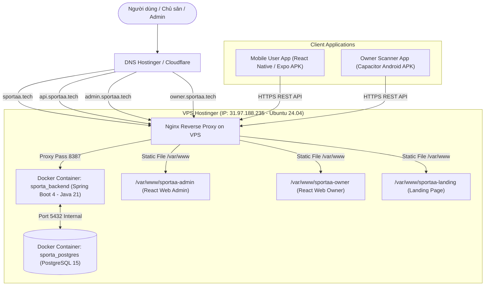

# 🚀 TỔNG HỢP TOÀN BỘ CẤU HÌNH HOSTING & TRIỂN KHAI HỆ THỐNG SPORTA PLATFORM

Tài liệu này tóm tắt chi tiết toàn bộ thông tin máy chủ, tên miền, kiến trúc hạ tầng và mã nguồn triển khai thực tế cho toàn bộ hệ sinh thái **Sporta Platform** (Backend Java Spring Boot, PostgreSQL, Web Admin, Web Owner, Mobile User Expo).

---

## 📌 I. THÔNG TIN HẠ TẦNG & MÁY CHỦ (SERVER INFO)

| Mục | Thông tin chi tiết | Ghi chú |
| :--- | :--- | :--- |
| **Nhà cung cấp VPS** | **Hostinger VPS KVM 2** | 2 vCPU, 8 GB RAM, 100 GB NVMe SSD |
| **Vị trí máy chủ (Location)** | **Malaysia / Singapore** | Ping về VN ~40-60ms, kết nối ổn định |
| **Hệ điều hành (OS)** | **Ubuntu 24.04 Noble LTS** | Bản Plain OS tối ưu tài nguyên |
| **Địa chỉ IP VPS** | **`31.97.188.235`** | IP tĩnh cố định |
| **Hostname VPS** | **`srv1957321.hstgr.cloud`** | Hostinger default hostname |
| **Tài khoản SSH** | `ssh root@31.97.188.235` | Cổng mặc định `22` |
| **Tên miền chính (Domain)** | **`sportaa.tech`** | Đăng ký & quản lý DNS trên Hostinger |

---

## 🌐 II. BẢNG CẤU HÌNH DNS (A RECORDS)

Tất cả các bản ghi DNS được cấu hình trong mục **DNS Management** của Hostinger trỏ về IP **`31.97.188.235`**:

| Loại (Type) | Host / Name | Trỏ tới (Value / Points to) | TTL | Chức năng trong hệ thống |
| :--- | :--- | :--- | :--- | :--- |
| **A** | `@` | `31.97.188.235` | Auto / 300 | `https://sportaa.tech` (Trang chủ giới thiệu / Landing) |
| **A** | `www` | `31.97.188.235` | Auto / 300 | `https://www.sportaa.tech` |
| **A** | `api` | `31.97.188.235` | Auto / 300 | `https://api.sportaa.tech` (Backend Spring Boot API) |
| **A** | `admin` | `31.97.188.235` | Auto / 300 | `https://admin.sportaa.tech` (Cổng Quản Trị Web Admin) |
| **A** | `owner` | `31.97.188.235` | Auto / 300 | `https://owner.sportaa.tech` (Cổng Quản Lý Chủ Sân) |

---

## 🏗️ III. SƠ ĐỒ KIẾN TRÚC TRIỂN KHAI (SYSTEM ARCHITECTURE)



---

## 💻 IV. TOÀN BỘ CODE CẤU HÌNH CHI TIẾT (CONFIGURATION FILES)

### 1. File Nginx Reverse Proxy & Virtual Hosts
📁 **Đường dẫn**: `/etc/nginx/sites-available/sportaa.tech.conf` (Trong repo: `nginx/sportaa.tech.conf`)

```nginx
# =========================================================================
# SPORTA PLATFORM - NGINX CONFIGURATION (sportaa.tech)
# =========================================================================

# 1. BACKEND API: api.sportaa.tech
server {
    listen 80;
    listen [::]:80;
    server_name api.sportaa.tech;

    client_max_body_size 100M;

    location / {
        proxy_pass http://127.0.0.1:8387;
        proxy_http_version 1.1;
        proxy_set_header Upgrade $http_upgrade;
        proxy_set_header Connection 'upgrade';
        proxy_set_header Host $host;
        proxy_set_header X-Real-IP $remote_addr;
        proxy_set_header X-Forwarded-For $proxy_add_x_forwarded_for;
        proxy_set_header X-Forwarded-Proto $scheme;
        proxy_cache_bypass $http_upgrade;
        proxy_read_timeout 300s;
        proxy_connect_timeout 75s;
    }
}

# 2. WEB ADMIN: admin.sportaa.tech
server {
    listen 80;
    listen [::]:80;
    server_name admin.sportaa.tech;

    root /var/www/sportaa-admin;
    index index.html index.htm;
    client_max_body_size 100M;

    location /api/ {
        proxy_pass http://127.0.0.1:8387;
        proxy_http_version 1.1;
        proxy_set_header Upgrade $http_upgrade;
        proxy_set_header Connection 'upgrade';
        proxy_set_header Host $host;
        proxy_set_header X-Real-IP $remote_addr;
        proxy_set_header X-Forwarded-For $proxy_add_x_forwarded_for;
        proxy_set_header X-Forwarded-Proto $scheme;
    }

    location / {
        try_files $uri $uri/ /index.html;
    }

    gzip on;
    gzip_types text/plain text/css application/json application/javascript text/xml application/xml application/xml+rss text/javascript image/svg+xml;
    gzip_min_length 256;

    location ~* \.(js|css|png|jpg|jpeg|gif|ico|svg|woff|woff2|ttf|eot)$ {
        expires 1y;
        add_header Cache-Control "public, no-transform";
    }
}

# 3. WEB OWNER: owner.sportaa.tech
server {
    listen 80;
    listen [::]:80;
    server_name owner.sportaa.tech;

    root /var/www/sportaa-owner;
    index index.html index.htm;
    client_max_body_size 100M;

    location /api/ {
        proxy_pass http://127.0.0.1:8387;
        proxy_http_version 1.1;
        proxy_set_header Upgrade $http_upgrade;
        proxy_set_header Connection 'upgrade';
        proxy_set_header Host $host;
        proxy_set_header X-Real-IP $remote_addr;
        proxy_set_header X-Forwarded-For $proxy_add_x_forwarded_for;
        proxy_set_header X-Forwarded-Proto $scheme;
    }

    location / {
        try_files $uri $uri/ /index.html;
    }

    gzip on;
    gzip_types text/plain text/css application/json application/javascript text/xml application/xml application/xml+rss text/javascript image/svg+xml;
    gzip_min_length 256;

    location ~* \.(js|css|png|jpg|jpeg|gif|ico|svg|woff|woff2|ttf|eot)$ {
        expires 1y;
        add_header Cache-Control "public, no-transform";
    }
}

# 4. LANDING PAGE & PORTAL: sportaa.tech / www.sportaa.tech
server {
    listen 80;
    listen [::]:80;
    server_name sportaa.tech www.sportaa.tech;

    root /var/www/sportaa-landing;
    index index.html index.htm;

    location / {
        try_files $uri $uri/ /index.html;
    }

    gzip on;
    gzip_types text/plain text/css application/json application/javascript text/xml application/xml application/xml+rss text/javascript image/svg+xml;
}
```

---

### 2. File Dockerfile Backend Spring Boot (Java 21)
📁 **Đường dẫn**: `backend/sporta/Dockerfile`

```dockerfile
# ==========================================
# STAGE 1: Build JAR with Maven & Java 21
# ==========================================
FROM maven:3.9.6-eclipse-temurin-21-alpine AS builder
WORKDIR /build

# Copy Maven descriptor and download dependencies
COPY pom.xml .
COPY .mvn .mvn
COPY mvnw .
RUN mvn dependency:go-offline -B || true

# Copy source code and build production JAR
COPY src ./src
RUN mvn clean package -DskipTests

# ==========================================
# STAGE 2: Lightweight Runtime Container
# ==========================================
FROM eclipse-temurin:21-jre-alpine
WORKDIR /app

# Create non-root application user
RUN addgroup -S sporta && adduser -S sporta -G sporta

# Copy built JAR from builder
COPY --from=builder /build/target/*.jar app.jar

# Ensure proper permissions
RUN chown -R sporta:sporta /app

USER sporta
EXPOSE 8387

# JVM memory flags optimized for VPS
ENV JAVA_OPTS="-Xms512m -Xmx1536m -XX:+UseG1GC -Djava.security.egd=file:/dev/./urandom"

ENTRYPOINT ["sh", "-c", "java $JAVA_OPTS -jar app.jar"]
```

---

### 3. File Docker Compose Production
📁 **Đường dẫn**: `docker-compose.prod.yml`

```yaml
version: '3.8'

services:
  # ==========================================
  # Database: PostgreSQL 15 Alpine
  # ==========================================
  postgres-db:
    image: postgres:15-alpine
    container_name: sporta_postgres
    restart: always
    environment:
      POSTGRES_USER: ${DB_USERNAME:-sporta_dev}
      POSTGRES_PASSWORD: ${DB_PASSWORD:-sporta_password}
      POSTGRES_DB: ${DB_NAME:-sporta_database}
    volumes:
      - postgres_data:/var/lib/postgresql/data
    networks:
      - sporta_network
    healthcheck:
      test: ["CMD-SHELL", "pg_isready -U ${DB_USERNAME:-sporta_dev} -d ${DB_NAME:-sporta_database}"]
      interval: 5s
      timeout: 5s
      retries: 5

  # ==========================================
  # Backend API: Spring Boot (Java 21)
  # ==========================================
  sporta-backend:
    build:
      context: ./backend/sporta
      dockerfile: Dockerfile
    container_name: sporta_backend
    restart: always
    depends_on:
      postgres-db:
        condition: service_healthy
    env_file:
      - ./backend/sporta/.env
    environment:
      - SPRING_DATASOURCE_URL=jdbc:postgresql://postgres-db:5432/${DB_NAME:-sporta_database}
      - SPRING_DATASOURCE_USERNAME=${DB_USERNAME:-sporta_dev}
      - SPRING_DATASOURCE_PASSWORD=${DB_PASSWORD:-sporta_password}
      - SERVER_PORT=8387
      - SERVER_ADDRESS=0.0.0.0
    ports:
      - "127.0.0.1:8387:8387"
    networks:
      - sporta_network

networks:
  sporta_network:
    driver: bridge

volumes:
  postgres_data:
    driver: local
```

---

### 4. Script Tự Động Thiết Lập Môi Trường VPS (`deploy-vps.sh`)
📁 **Đường dẫn**: `deploy-vps.sh`

```bash
#!/usr/bin/env bash
set -e

echo "=========================================================="
echo "🚀 SPORTA PLATFORM - PRODUCTION SETUP SCRIPT FOR VPS"
echo "🌐 Domain: sportaa.tech | IP: 31.97.188.235"
echo "=========================================================="

# 1. Update system & install dependencies
echo "[1/6] Installing Nginx, Certbot and Docker Compose plugin..."
apt update
apt install -y nginx certbot python3-certbot-nginx docker-compose-plugin git curl ufw || true

# If docker is not installed, install docker-ce
if ! command -v docker &> /dev/null; then
    echo "Installing Docker..."
    curl -fsSL https://get.docker.com | sh
fi

# Enable and start Docker & Nginx
systemctl enable docker
systemctl start docker
systemctl enable nginx
systemctl start nginx

# 2. Setup Firewall
echo "[2/6] Configuring UFW Firewall..."
ufw allow OpenSSH
ufw allow 'Nginx Full'
ufw --force enable

# 3. Create Web directories
echo "[3/6] Creating web root directories..."
mkdir -p /var/www/sportaa-admin
mkdir -p /var/www/sportaa-owner
mkdir -p /var/www/sportaa-landing

# Copy landing page if present
if [ -f "./landing/index.html" ]; then
    cp ./landing/index.html /var/www/sportaa-landing/index.html
fi

# 4. Copy Nginx Configuration
echo "[4/6] Setting up Nginx configuration..."
if [ -f "./nginx/sportaa.tech.conf" ]; then
    cp ./nginx/sportaa.tech.conf /etc/nginx/sites-available/sportaa.tech.conf
    ln -sf /etc/nginx/sites-available/sportaa.tech.conf /etc/nginx/sites-enabled/sportaa.tech.conf
    rm -f /etc/nginx/sites-enabled/default || true
    nginx -t
    systemctl reload nginx
fi

# 5. Start Backend and PostgreSQL
echo "[5/6] Building and starting Backend (Spring Boot 4) & PostgreSQL 15..."
if [ -f "docker-compose.prod.yml" ]; then
    if docker compose version &> /dev/null; then
        docker compose -f docker-compose.prod.yml down || true
        docker compose -f docker-compose.prod.yml up -d --build
    else
        docker-compose -f docker-compose.prod.yml down || true
        docker-compose -f docker-compose.prod.yml up -d --build
    fi
fi

echo "=========================================================="
echo "🎉 Backend & Services are running!"
echo "👉 Next step: Run SSL certificate generation with Certbot:"
echo "   certbot --nginx -d sportaa.tech -d www.sportaa.tech -d api.sportaa.tech -d admin.sportaa.tech -d owner.sportaa.tech"
echo "=========================================================="
```

---

### 5. Script Build & Deploy Web Frontend (`build-frontends.sh`)
📁 **Đường dẫn**: `build-frontends.sh`

```bash
#!/usr/bin/env bash
set -e

echo "=========================================================="
echo "🏗️  BUILDING AND DEPLOYING WEB-ADMIN & WEB-OWNER"
echo "=========================================================="

# 1. Install Node.js 20 LTS if not present
if ! command -v node &> /dev/null; then
    echo "Installing Node.js 20 LTS..."
    curl -fsSL https://deb.nodesource.com/setup_20.x | bash -
    apt install -y nodejs
fi

echo "Node.js version: $(node -v)"
echo "NPM version: $(npm -v)"

# 2. Build Web Admin
echo "📦 Building Web Admin..."
cd /root/sporta-platform/web-admin
npm install
npm run build
mkdir -p /var/www/sportaa-admin
rm -rf /var/www/sportaa-admin/*
cp -r dist/* /var/www/sportaa-admin/
echo "✅ Web Admin deployed to /var/www/sportaa-admin"

# 3. Build Web Owner
echo "📦 Building Web Owner..."
cd /root/sporta-platform/web-owner
npm install
npm run build
mkdir -p /var/www/sportaa-owner
rm -rf /var/www/sportaa-owner/*
cp -r dist/* /var/www/sportaa-owner/
echo "✅ Web Owner deployed to /var/www/sportaa-owner"

# 4. Set permissions
chown -R www-data:www-data /var/www/sportaa-admin /var/www/sportaa-owner /var/www/sportaa-landing
chmod -R 755 /var/www/sportaa-admin /var/www/sportaa-owner /var/www/sportaa-landing

echo "=========================================================="
echo "🎉 SUCCESS! All frontends are live:"
echo "👉 Admin: https://admin.sportaa.tech"
echo "👉 Owner: https://owner.sportaa.tech"
echo "=========================================================="
```

---

## ⚙️ V. CẤU HÌNH BIẾN MÔI TRƯỜNG PRODUCTION (.env)

### 1. `web-admin/.env.production`
```env
VITE_API_BASE_URL=https://api.sportaa.tech/api/v1
```

### 2. `web-owner/.env.production`
```env
VITE_API_BASE_URL=https://api.sportaa.tech/api/v1
```

### 3. `mobile-user/.env`
```env
EXPO_PUBLIC_API_URL=https://api.sportaa.tech/api/v1
EXPO_PUBLIC_GOONG_API_KEY=TW0sH2XGWngVrfsNz8XrD2JpWSFhjLna8m3XqmOS
EXPO_PUBLIC_GOONG_MAP_KEY=8n7WDTHRsELT9F8UA4g3nsDbFWn5KQPig2dDkJHZ
```

### 4. `backend/sporta/.env` (Cấu hình bảo mật trên VPS)
```env
DB_USERNAME=sporta_dev
DB_PASSWORD=<mat_khau_database_cua_ban>
DB_NAME=sporta_database

JWT_SECRET=<khoa_bi_mat_jwt_dai_hon_32_ky_tu>
JWT_EXPIRATION_MS=86400000

# Cloudflare R2 Storage (Lưu trữ ảnh avatar, bài viết, sân)
R2_ACCESS_KEY_ID=<your_r2_access_key>
R2_SECRET_ACCESS_KEY=<your_r2_secret_key>
R2_BUCKET_NAME=sporta-bucket
R2_PUBLIC_URL=https://pub-xxxx.r2.dev

# Cổng thanh toán PayOS
PAYOS_CLIENT_ID=<your_payos_client_id>
PAYOS_API_KEY=<your_payos_api_key>
PAYOS_CHECKSUM_KEY=<your_payos_checksum_key>
```

---

## 🛠️ VI. CÁC LỆNH VẬN HÀNH & BẢO TRÌ VPS THƯỜNG DÙNG

### 1. Kết nối SSH vào VPS
```bash
ssh root@31.97.188.235
```

### 2. Cấp / Gia hạn SSL HTTPS Let's Encrypt
```bash
certbot --nginx -d sportaa.tech -d www.sportaa.tech -d api.sportaa.tech -d admin.sportaa.tech -d owner.sportaa.tech
```

### 3. Cập nhật mã nguồn & Deploy lại Backend
```bash
cd /root/sporta-platform
git pull origin dev
docker compose -f docker-compose.prod.yml up -d --build
```

### 4. Xem Logs Backend Spring Boot theo thời gian thực
```bash
docker logs -f --tail 100 sporta_backend
```

### 5. Kiểm tra trạng thái Container & Tài nguyên RAM/CPU
```bash
docker ps
docker stats
```

### 6. Khởi động lại Nginx
```bash
nginx -t && systemctl reload nginx
```
