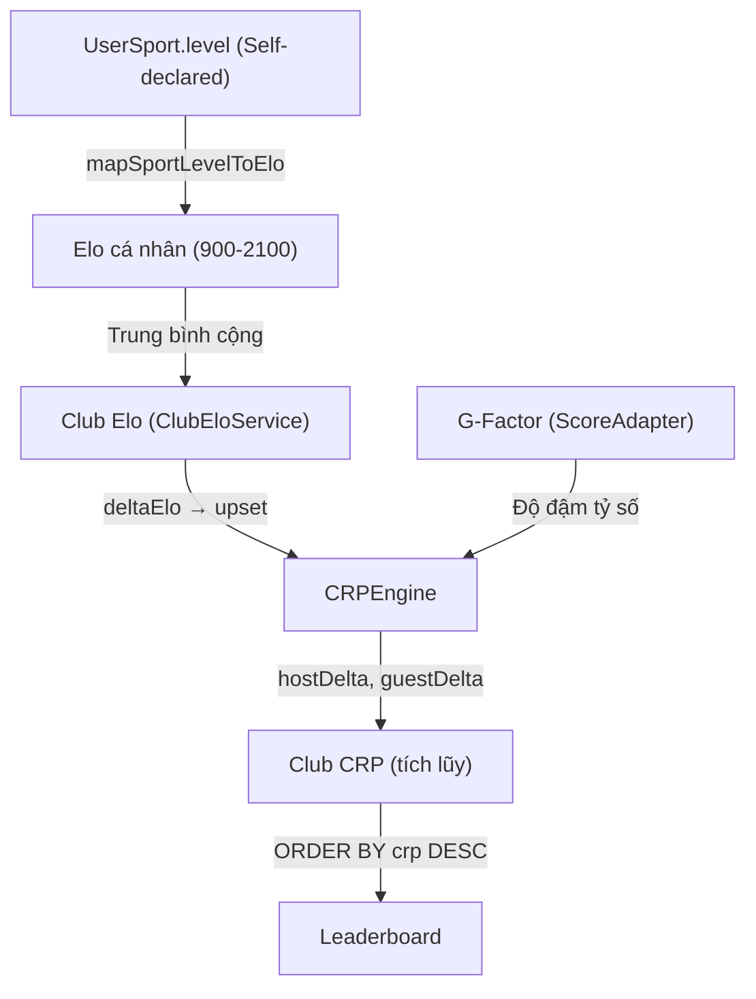

# 🔍 Kiểm toán Hệ thống Elo & CRP — Lỗ hổng thực sự

## Tóm tắt kiến trúc hiện tại



---

## 🚨 LỖ HỔNG NGHIÊM TRỌNG (Critical)

### 1. Elo cá nhân là tự khai báo — Không bao giờ thay đổi

> [!CAUTION]
> `UserSport.level` là **giá trị người dùng tự chọn khi đăng ký** và **KHÔNG BAO GIỜ được cập nhật** dựa trên kết quả trận đấu.

**Hiện trạng trong code**: [UserSport.java](file:///c:/Users/buida/sporta-platform/backend/sporta/src/main/java/com/backend/sporta/entity/UserSport.java)
- Chỉ có 1 trường `level` kiểu `SportLevel` enum.
- Không có trường nào như `matchesPlayed`, `winRate`, `eloRating` ở cấp cá nhân.
- `mapSportLevelToElo()` cứng (900, 1200, 1500, 1800, 2100) — **static, bất biến**.

**Hậu quả**:
- Elo CLB = trung bình của các giá trị "tự nhận" → **hoàn toàn không phản ánh thực lực**.
- Một CLB với 10 người tự nhận "Khá" (`GOOD`) sẽ có Elo = 2100 mãi mãi, dù thua 50 trận liên tiếp.
- **Exploit**: CLB A có 10 người khai `WEAK` → Elo = 900. Thực chất rất mạnh. Đánh với CLB B (Elo 1800) → luôn được thưởng Upset cực lớn khi thắng.

---

### 2. Club.elo chẳng bao giờ được dùng thực tế

**Hiện trạng**: [Club.java](file:///c:/Users/buida/sporta-platform/backend/sporta/src/main/java/com/backend/sporta/entity/Club.java) có trường `elo = 1000` (mặc định).

Nhưng trong [ClubEloService.getClubElo()](file:///c:/Users/buida/sporta-platform/backend/sporta/src/main/java/com/backend/sporta/service/matchmaking/ClubEloService.java#L29-L60):
```java
// Chỉ dùng club.elo khi activeMembers.isEmpty()
if (activeMembers.isEmpty()) {
    return club.getElo() != null ? club.getElo() : 1000;
}
// Ngược lại, LUÔN tính trung bình từ UserSport.level
return (int) Math.round((double) totalElo / count);
```

Và `club.elo` **CHỈ được set từ AdminController** (ClubServiceImpl):
```java
if (request.getElo() != null) club.setElo(request.getElo());
```

**Vấn đề**: Trường `elo` trong DB tồn tại nhưng vô dụng — `getClubElo()` luôn override nó bằng trung bình cộng UserSport. Gây hiểu nhầm cho dev.

---

### 3. Bất đối xứng Win/Loss: Kẻ thắng luôn lời, kẻ thua ít mất

> [!WARNING]
> Hệ thống CRP hiện tại **KHÔNG phải zero-sum**.

**Code trong** [CRPEngine.java:119-155](file:///c:/Users/buida/sporta-platform/backend/sporta/src/main/java/com/backend/sporta/service/matchmaking/CRPEngine.java#L119-L155):

| Trường hợp | Kèo trên thắng | Kèo dưới lật kèo |
|---|---|---|
| **Winner gain** | `Math.max(1, winBase * G - upset)` | `Math.max(1, winBase * G + upset)` |
| **Loser loss** | `Math.max(1, lossBase * G - upset)` | `Math.max(1, lossBase * G + upset)` |

Với `winBase = 25`, `lossBase = 15`, `G = 1.0`, `upset = 0` (Elo bằng nhau):
- Winner: **+25**
- Loser: **-15**
- **Net inject**: +10 CRP vào hệ thống mỗi trận!

**Hậu quả**: CRP **lạm phát** theo thời gian — càng nhiều trận, tổng CRP toàn hệ thống càng tăng. Sau 1000 trận, tổng CRP sẽ tăng ~10,000 điểm so với ban đầu → CLB chơi nhiều sẽ luôn xếp cao hơn CLB chơi ít dù trình độ bằng nhau.

---

### 4. Exploit Farming bằng Smurf Club

> [!CAUTION]
> Anti-farming hiện tại chỉ chặn **cùng cặp CLB**, không chặn **cùng nhóm người**.

**Kịch bản**:
1. Nhóm 20 người tạo CLB "Alpha" và CLB "Beta"
2. Alpha vs Beta: đấu 10 trận Ranked → bị chặn anti-farming
3. Tạo CLB "Gamma" với cùng 20 người → Alpha vs Gamma: đấu tiếp 10 trận
4. Lặp lại vô hạn

**Code**: [MatchRepository](file:///c:/Users/buida/sporta-platform/backend/sporta/src/main/java/com/backend/sporta/repository/MatchRepository.java#L27-L33) chỉ check `clubA.id` vs `clubB.id`, không check overlap thành viên.

---

### 5. G-Factor bị cap tại [0.5, 1.0] — Thắng sát nút vẫn được 50% reward

**Code** [FootballScoreAdapter](file:///c:/Users/buida/sporta-platform/backend/sporta/src/main/java/com/backend/sporta/service/matchmaking/FootballScoreAdapter.java#L42-L48):
```java
double rawG = 0.5 + 0.5 * (margin / scale);  // scale = 5.0
return Math.max(0.5, Math.min(1.0, rawG));
```

- Thắng 1-0: G = 0.5 + 0.5*(1/5) = **0.6** → +15 CRP
- Thắng 5-0: G = 0.5 + 0.5*(5/5) = **1.0** → +25 CRP
- Thắng 10-0: G = vẫn **1.0** (capped) → +25 CRP

**Vấn đề**: Floor quá cao (0.5). Thắng 1-0 với thắng 3-0 chênh CRP rất ít, không phản ánh đúng "dominance".

---

### 6. Hòa = 0 CRP — Không có ý nghĩa chiến thuật

**Code** [CRPEngine:92-106](file:///c:/Users/buida/sporta-platform/backend/sporta/src/main/java/com/backend/sporta/service/matchmaking/CRPEngine.java#L92-L106): Hòa → `delta = 0` cho cả hai.

**Vấn đề**: CLB yếu cầm hòa CLB mạnh hơn nhiều → **không được thưởng gì**. Trong Elo thực tế (FIFA, Chess), hòa với đối thủ mạnh hơn = cộng điểm (vì expected win probability thấp).

---

## ⚠️ LỖ HỔNG TRUNG BÌNH (Medium)

### 7. Race Condition: CRP snapshot bị stale

Khi `confirmScore()` gọi, nó đọc `crpBeforeSnapshot` từ thời điểm **match creation** (khi `acceptJoinRequest`), không phải thời điểm confirm.

**Code** [CRPEngine:46-52](file:///c:/Users/buida/sporta-platform/backend/sporta/src/main/java/com/backend/sporta/service/matchmaking/CRPEngine.java#L46-L52):
```java
int hostCrpBefore = (match.getHostCrpBeforeSnapshot() != null && match.getHostCrpBeforeSnapshot() > 0)
    ? match.getHostCrpBeforeSnapshot()
    : (match.getHostClub() != null && match.getHostClub().getCrp() != null ? match.getHostClub().getCrp() : 100);
```

**Kịch bản**:
1. CLB A có CRP = 100 → ghép kèo, snapshot = 100
2. CLB A đá trận khác, thắng → CRP = 125
3. Trận cũ confirm → CRP before = **100** (snapshot) → after = 100 + 25 = 125
4. Nhưng CRP thực tế là 125 → **bị ghi đè thành 125**, mất 25 CRP đã kiếm!

**Code ghi đè**: [MatchmakingServiceImpl:735](file:///c:/Users/buida/sporta-platform/backend/sporta/src/main/java/com/backend/sporta/service/MatchmakingServiceImpl.java#L735):
```java
hostClub.setCrp(crpRes.getHostCrpAfter()); // Ghi đè CRP hiện tại
```

**Đây là bug nghiêm trọng** — nếu 2 trận confirm gần nhau, trận confirm sau sẽ ghi đè CRP của trận confirm trước.

---

### 8. Leaderboard N+1 Query Problem

**Code** [LeaderboardServiceImpl](file:///c:/Users/buida/sporta-platform/backend/sporta/src/main/java/com/backend/sporta/service/LeaderboardServiceImpl.java#L33-L54):
```java
for (int i = start; i < end; i++) {
    Club club = clubs.get(i);
    int elo = clubEloService.getClubElo(club);       // Query 1: members
    String levelLabel = clubEloService.getLevelLabel(elo);
    int activeMembers = clubEloService.getActiveMemberCount(club.getId()); // Query 2: count
}
```

Mỗi CLB trong leaderboard = 2 query thêm (members + count). Với 100 CLB = **200 queries** → performance disaster.

---

### 9. Trường `Club.elo` field mặc định 1000 nhưng CRP dùng 100

- `Club.elo` default = **1000** ([Club.java:48](file:///c:/Users/buida/sporta-platform/backend/sporta/src/main/java/com/backend/sporta/entity/Club.java#L48))
- `CRPEngine` khi không có snapshot: fallback CRP = **100** ([CRPEngine:48](file:///c:/Users/buida/sporta-platform/backend/sporta/src/main/java/com/backend/sporta/service/matchmaking/CRPEngine.java#L48))
- `Club.crp` default = **0** ([Club.java:52](file:///c:/Users/buida/sporta-platform/backend/sporta/src/main/java/com/backend/sporta/entity/Club.java#L52))

→ 3 con số mặc định khác nhau cho cùng một concept "starting value", gây inconsistency.

---

### 10. Admin có thể set Elo tùy ý, bypass toàn bộ hệ thống

[ClubServiceImpl:111](file:///c:/Users/buida/sporta-platform/backend/sporta/src/main/java/com/backend/sporta/service/ClubServiceImpl.java#L111):
```java
if (request.getElo() != null) club.setElo(request.getElo());
```

Nhưng vì `ClubEloService.getClubElo()` luôn **override** từ thành viên, nên admin set Elo → không có tác dụng (trừ khi CLB không có thành viên nào). Gây confusion.

---

## 📊 So sánh với các hệ thống chuẩn

| Tiêu chí | Elo Chess/FIFA | CRP Sporta hiện tại |
|---|---|---|
| **Elo cập nhật sau trận** | ✅ Luôn cập nhật | ❌ Không bao giờ thay đổi |
| **Zero-sum** | ✅ Tổng điểm hệ thống = const | ❌ Lạm phát +10/trận |
| **Hòa có ý nghĩa** | ✅ Cộng/trừ theo expected | ❌ Hòa = 0 cho cả hai |
| **Decay khi không hoạt động** | ✅ Có (FIFA Monthly)| ❌ Không có |
| **Anti-smurf** | ✅ Placement matches | ❌ Chỉ check cặp CLB |
| **K-factor giảm dần** | ✅ K giảm khi nhiều trận | ❌ Cố định mãi |

---

## 🎯 Đề xuất sửa (ưu tiên)

### Tier 1 — Fix ngay (Critical bugs)

1. **Fix Race Condition CRP**: Thay `hostClub.setCrp(crpRes.getHostCrpAfter())` bằng:
   ```java
   hostClub.setCrp(hostClub.getCrp() + crpRes.getHostCrpDelta());
   ```
   → Cộng delta thay vì ghi đè tuyệt đối.

2. **Cân bằng Win/Loss**: Làm zero-sum bằng cách set `lossBase = winBase`:
   ```yaml
   ranking.crp.win-base: 20
   ranking.crp.loss-base: 20
   ```
   Hoặc tốt hơn: `loserLoss = winnerGain` (dynamic zero-sum).

3. **Hòa có thưởng/phạt**: CLB yếu hơn hòa CLB mạnh → cộng nhẹ, CLB mạnh hòa CLB yếu → trừ nhẹ.

### Tier 2 — Refactor (1-2 sprint)

4. **Dynamic Elo cá nhân**: Thêm trường `eloRating` vào `UserSport`, cập nhật sau mỗi trận CLB tham gia. Hoặc ít nhất thêm weighted average (Captain/Core member quan trọng hơn bench).

5. **K-factor giảm dần**: CLB mới (<10 trận) K=32, CLB lâu năm (>50 trận) K=16. Giúp CLB mới nhanh tìm được vị trí, CLB cũ ổn định.

6. **Anti-smurf**: Thêm check overlap thành viên giữa 2 CLB. Nếu >50% trùng → chặn ranked.

### Tier 3 — Nâng cấp (Future)

7. **CRP Decay**: Trừ 2% CRP mỗi tháng nếu CLB không đá trận Ranked nào.
8. **Placement Matches**: 5 trận đầu tiên K=40, không hiện trên Leaderboard.
9. **Season Reset**: Reset CRP theo mùa (giữ lại base line từ season trước).
