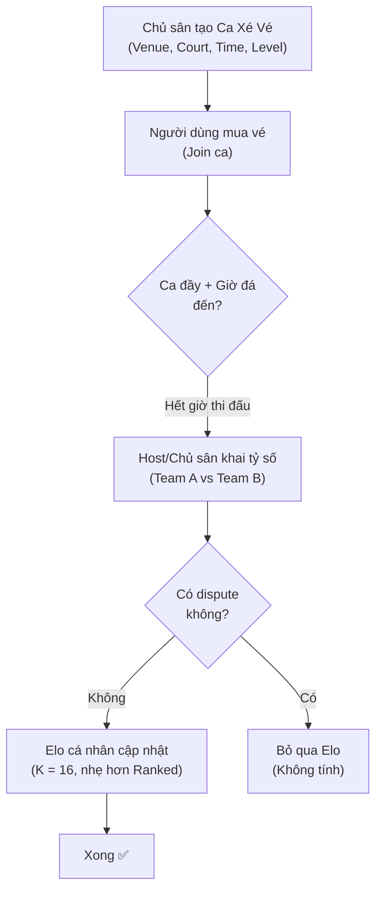
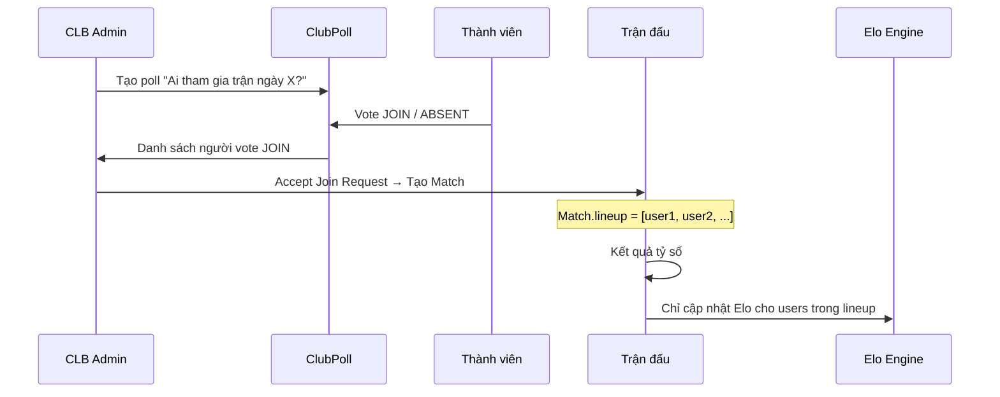
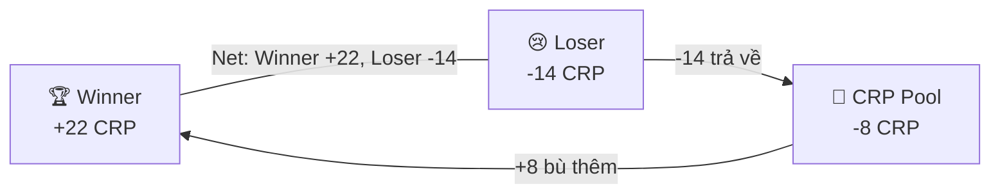

# 💬 Phản hồi Thảo luận Thiết kế Elo/CRP

---

## 1A. Xé Vé vs Pickup Match — Nên gộp hay tách?

### Phân tích TicketSession hiện tại

Sau khi đọc code [TicketSession](file:///c:/Users/buida/sporta-platform/backend/sporta/src/main/java/com/backend/sporta/entity/TicketSession.java) và [UserTicketService](file:///c:/Users/buida/sporta-platform/backend/sporta/src/main/java/com/backend/sporta/service/UserTicketService.java), tôi thấy:

| Đặc điểm | Xé Vé hiện tại | Pickup Match (đề xuất cũ) |
|-----------|----------------|--------------------------|
| **Ai tạo** | Chủ sân (Owner) | Người dùng (Player) |
| **Ai join** | Cá nhân (mua vé) | Cá nhân |
| **Mục đích** | Tìm người ghép sân | Tìm người đấu + tính Elo |
| **Kết quả trận** | ❌ Không track | ✅ Có khai tỷ số |
| **Elo ảnh hưởng** | ❌ Không | ✅ Có |
| **Đã có trường `sportLevel`** | ✅ Có | N/A |

### Kết luận: **KHÔNG cần tách riêng Pickup. Mở rộng Xé Vé v2 thêm lớp "post-match" là đủ.**

Lý do:
- Bản chất Xé Vé **đã là** pickup match — người lạ ghép sân đá chung
- Chỉ thiếu phần **khai tỷ số + tính Elo** sau trận
- Tách riêng Pickup = duplicate logic + confuse user ("Xé Vé" và "Pickup" khác gì nhau?)

### Thiết kế Xé Vé v2 (Elo-enabled)



**Thay đổi entity**:
```java
// Thêm vào TicketSession
@Column(name = "host_score")
private String hostScore;         // Tỷ số team A

@Column(name = "guest_score") 
private String guestScore;        // Tỷ số team B

@Enumerated(EnumType.STRING)
@Column(name = "match_outcome")
private NormalizedOutcome matchOutcome; // WIN_HOST, WIN_GUEST, DRAW, null

@Column(name = "is_elo_settled")
@Builder.Default
private Boolean isEloSettled = false;
```

**Điểm quan trọng**:
- Xé Vé dùng **K-factor = 16** (nhẹ hơn Placement K=48 và Ranked K=24) vì:
  - Không biết ai thực sự ở team nào
  - Chỉ chủ sân khai → ít tin cậy hơn trận CLB (có 2 bên confirm)
  - Mục đích chính: giúp user "warm up" Elo ban đầu, không phải competitive
- **Không cần Peer Review** cho Xé Vé (bạn đã nêu đúng — người lạ, không quen nhau)

---

## 1B. Vote Tham gia → Match Lineup

### Phân tích hệ thống Poll hiện tại

[ClubPoll](file:///c:/Users/buida/sporta-platform/backend/sporta/src/main/java/com/backend/sporta/entity/ClubPoll.java) + [ClubPollVote](file:///c:/Users/buida/sporta-platform/backend/sporta/src/main/java/com/backend/sporta/entity/ClubPollVote.java) đã có:
- `PollVoteOption.JOIN` / `ABSENT` — ai đi, ai không
- `matchmadeTeams` (JSON) — chia đội
- Liên kết với CLB qua `club_id`

### Thiết kế Lineup Flow



**Logic cốt lõi**: Khi `confirmScore()` chạy, chỉ update Elo cho những user đã vote `JOIN` **VÀ** đã được Admin chấp nhận vào lineup:

```java
private List<User> getMatchLineup(Match match) {
    // Lấy poll liên kết với match (nếu có)
    // Nếu không có poll → fallback: tất cả APPROVED members
    ClubPoll poll = clubPollRepository
        .findByClubIdAndMatchId(match.getHostClub().getId(), match.getId())
        .orElse(null);
    
    if (poll != null) {
        return clubPollVoteRepository.findByPollIdAndOption(poll.getId(), PollVoteOption.JOIN)
            .stream().map(ClubPollVote::getUser).collect(Collectors.toList());
    }
    
    // Fallback: tất cả approved members
    return clubMemberRepository.findByClubIdAndStatus(
        match.getHostClub().getId(), ClubMemberStatus.APPROVED)
        .stream().map(ClubMember::getUser).collect(Collectors.toList());
}
```

> [!NOTE]
> Cần thêm liên kết giữa `ClubPoll` và `Match` (thêm `match_id` hoặc `room_id` vào ClubPoll) để biết poll nào thuộc trận nào.

---

## 2A. Huy hiệu cho Elo VERIFIED

**Có**, tôi đề xuất hệ thống Badge đơn giản:

| Status | Badge | UI hiển thị | Ý nghĩa |
|--------|-------|-------------|---------|
| `UNVERIFIED` | 🔘 (mờ) | Elo 1500 *(tự khai)* | Chưa đấu trận nào |
| `CALIBRATING` | ⏳ | Elo 1420 *(3/5 trận)* | Đang trong Placement |
| `VERIFIED` | ✅ | Elo 1380 ✅ | Đã qua 5 trận → Elo đáng tin |

**Hiển thị trong**:
- Profile cá nhân
- Danh sách thành viên CLB ([ClubMemberResponse](file:///c:/Users/buida/sporta-platform/backend/sporta/src/main/java/com/backend/sporta/dto/ClubMemberResponse.java))
- Leaderboard
- Match detail

**Khi CLB có yêu cầu Elo tối thiểu**: Chỉ chấp nhận `VERIFIED` Elo, không chấp nhận `UNVERIFIED`:

```java
if (club.getMinEloRequired() > 0) {
    if (userSport.getEloStatus() != EloStatus.VERIFIED) {
        throw new CustomException(
            "CLB này yêu cầu Elo đã xác minh (VERIFIED). " +
            "Hãy tham gia ít nhất 5 trận đấu để xác minh trình độ.", 400);
    }
    if (userSport.getEffectiveElo() < club.getMinEloRequired()) {
        throw new CustomException("Elo không đủ...", 400);
    }
}
```

---

## 2B. Đa môn thể thao — Dùng chung Elo hay hệ số khác?

### Kết luận: **Giữ chung 1 hệ thống Elo cho tất cả môn.**

Lý do:
1. **DUPR (Pickleball)** hay **UTR (Tennis)** thực chất cũng dựa trên nền tảng toán Elo, chỉ khác cách scale và presentation. Về bản chất toán học chúng tương đương.
2. Tạo nhiều hệ thống rating khác nhau sẽ gây **confusion cho user** ("Elo là gì? DUPR là gì? Sao môn này dùng cái này môn kia dùng cái khác?")
3. **Sporta không phải nền tảng chuyên biệt** cho 1 môn — nó là nền tảng tổng hợp → cần 1 thang đo thống nhất.

### Cách xử lý sự khác biệt giữa các môn

Sự khác biệt nằm ở **ScoreAdapter** (đã có), không nằm ở Elo formula:

| Thành phần | Bóng đá | Cầu lông/Pickleball | Bóng rổ |
|------------|---------|---------------------|---------|
| **Elo formula** | Giống nhau | Giống nhau | Giống nhau |
| **K-factor** | Giống nhau | Giống nhau | Giống nhau |
| **G-Factor (dominance)** | Dựa trên bàn thắng | Dựa trên số set | Dựa trên điểm |
| **Scale** | `footballScaleGoals=5.0` | `totalSets` | `basketballScalePoints=30.0` |

Mỗi `UserSport` đã là **1 bản ghi riêng per sport** → Elo đã tách biệt theo môn tự nhiên:

```
Quang → UserSport(sport=Bóng đá, eloRating=2500, status=VERIFIED)
Quang → UserSport(sport=Cầu lông, eloRating=1005, status=CALIBRATING)
Quang → UserSport(sport=Pickleball, eloRating=null, status=UNVERIFIED)
```

→ Mỗi môn có Elo riêng, nhưng cùng 1 hệ thống, cùng 1 scale, cùng 1 cách hiểu.

---

## 2C. Đánh giá đối thủ — Xử lý vote thấp cố tình & không đánh giá

### Kết luận: **Tạm bỏ tính năng Peer Review trong phase này.**

Lý do bạn nêu hoàn toàn chính xác:
1. **Vote thấp cố tình (griefing)**: Rất khó phân biệt "đánh giá chân thực" vs "trả thù" khi thua. Thuật toán loại bỏ outlier (ví dụ: bỏ rating cao nhất + thấp nhất) cũng không giải quyết triệt để khi chỉ có 2-3 người đánh giá.
2. **Không đánh giá**: Nếu 10 đối thủ nhưng chỉ 2 người rate → sample quá nhỏ, không có ý nghĩa thống kê.
3. **Xé vé**: Người lạ → không có động lực đánh giá + dễ bị bias.

### Thay thế bằng gì?

**"Behavioral Elo" — Hệ thống tự calibrate qua kết quả thực tế**, không cần human review:

```
Người khai GOOD (Elo seed = 2100) nhưng thực tế yếu:
→ Trận 1: Thua CLB Elo 1500 → Elo giảm mạnh (K=48): 2100 → 1980
→ Trận 2: Thua CLB Elo 1400 → 1980 → 1880
→ Trận 3: Thắng CLB Elo 1200 → 1880 → 1890 (ít tăng vì "đáng thắng")
→ Trận 4: Thua CLB Elo 1600 → 1890 → 1810
→ Trận 5: VERIFIED → Elo = ~1810 (thực tế khoảng TBK, không phải GOOD)
```

Sau 5 trận Placement, **hệ thống đã tự tìm ra trình độ thật** mà không cần ai đánh giá ai. Đây chính là sức mạnh của Elo — nó **self-correcting** qua đủ số trận.

> [!TIP]
> K=48 trong Placement nghĩa là mỗi trận Elo có thể biến động ±30~50 điểm. Sau 5 trận, sai lệch tối đa ~250 điểm so với seed → đủ để đưa người khai "GOOD" nhưng thực chất "TB" về đúng vùng.

---

## 2D. Elo mỗi môn khác nhau hay bằng nhau?

**Khác nhau — mỗi môn có Elo riêng biệt**, đã trả lời ở phần 2B:

```
Quang:
  ⚽ Bóng đá:  Elo 2500 ✅ (VERIFIED, 45 trận)
  🏸 Cầu lông: Elo 1005 ⏳ (CALIBRATING, 2/5 trận)
  🏓 Pickleball: Elo 1500 🔘 (UNVERIFIED, chưa đấu)
```

Điều này **hợp lý** vì:
- Giỏi đá bóng không có nghĩa giỏi cầu lông
- Mỗi UserSport đã là 1 row riêng → tự nhiên tách biệt

---

## 2E. Zero-sum gây chán nản — Giải pháp Asymmetric Zero-Sum + Bonus

### Vấn đề bạn nêu rất đúng

Nếu thua -20 và thắng +20, người thua sẽ:
- Cảm giác mất mát > niềm vui chiến thắng (Loss Aversion — tâm lý học)
- Chuỗi thua = spiral xuống, không muốn chơi tiếp

### Giải pháp: "Asymmetric Zero-Sum" + Bonus System

**Nguyên tắc**: Winner vẫn luôn được **nhiều hơn** loser mất, nhưng phần chênh lệch đến từ **CRP Pool (quỹ hệ thống)**, không phải in tiền từ không khí.



**Cách hoạt động**:

```java
// CRP Pool funded by:
// 1. CLB mới tạo: mỗi CLB bắt đầu với CRP = 100 (hệ thống cấp)
// 2. Phí tham gia Ranked Season (nếu có)
// 3. CRP decay hàng tháng (tương lai)

int rawDelta = (int) Math.round(winBase * gFactor); // 20

// Winner luôn được nhiều hơn loser mất
int winnerGain = rawDelta;                    // +20
int loserLoss = (int)(rawDelta * 0.7);        // -14 (chỉ mất 70%)
int poolSubsidy = winnerGain - loserLoss;     // 6 (pool bù)

// Upset modifier (zero-sum phần này)
if (winnerIsUnderdog) {
    winnerGain += upset;   // Bonus cho lật kèo
    loserLoss += upset;    // Phạt nặng hơn khi thua kèo dưới
}
```

| Tình huống | Winner nhận | Loser mất | Pool bù | Cảm nhận user |
|-----------|------------|----------|---------|---------------|
| Ngang Elo | +20 | -14 | -6 | Thua ít mất, thắng vẫn vui |
| Lật kèo | +28 | -22 | -6 | Upset thắng cảm giác rất thưởng |
| Kèo trên thắng | +16 | -10 | -6 | Thắng đáng thắng, thua ít đau |

### Thêm hệ thống Bonus (Điểm khuyến khích)

Để giữ người dùng tiếp tục chơi dù thua:

| Bonus | Điều kiện | CRP thưởng | Ghi chú |
|-------|----------|-----------|---------|
| 🔥 **Streak Bonus** | Thắng 3 trận liên tiếp | +5 bonus | Reset khi thua |
| 📅 **First Match of Day** | Trận Ranked đầu tiên trong ngày | +3 bonus | Khuyến khích hoạt động hàng ngày |
| 💪 **Comeback Bonus** | Thua 3+ trận rồi thắng 1 trận | +5 bonus | Giữ chân người thua |
| 🏅 **Weekly Activity** | Đá ≥3 trận Ranked/tuần | +5 bonus cuối tuần | Khuyến khích tần suất |

```java
// Bonus engine (chạy sau CRP settle)
private int calculateBonus(Club club, NormalizedOutcome outcome) {
    int bonus = 0;
    
    // Streak bonus
    int currentStreak = getWinStreak(club.getId());
    if (outcome == NormalizedOutcome.WIN_HOST || outcome == NormalizedOutcome.WIN_GUEST) {
        if (currentStreak >= 3) bonus += 5;
    }
    
    // First match of day
    if (isFirstRankedMatchToday(club.getId())) bonus += 3;
    
    // Comeback bonus  
    if (getLoseStreak(club.getId()) >= 3 && isWin) bonus += 5;
    
    return bonus; // Bonus lấy từ CRP Pool, không từ đối thủ
}
```

> [!IMPORTANT]
> **Bonus luôn lấy từ CRP Pool**, không từ đối thủ → Không ảnh hưởng tính công bằng của trận đấu.
> 
> Tổng CRP hệ thống vẫn **kiểm soát được** vì Pool có giới hạn (funded by CLB mới + decay + season fees). Khi Pool cạn → bonus giảm dần. Điều này tạo ra "nền kinh tế CRP" tự điều chỉnh.

### Tóm lại cơ chế mới:

```
CRP cuối cùng = Base CRP (Asymmetric Zero-Sum) + Upset Modifier + Bonus
                ↑ Từ đối thủ                      ↑ Từ đối thủ     ↑ Từ Pool
```

---

## Tổng kết quyết định

| Câu hỏi | Quyết định |
|---------|-----------|
| Pickup vs Xé Vé | **Mở rộng Xé Vé v2** (thêm post-match Elo settle) |
| Lineup | **Tận dụng ClubPoll** (vote JOIN → lineup) |
| Peer Review | **Bỏ** — dùng Behavioral Elo (self-correcting) |
| Đa môn | **Chung Elo, tách per sport** (UserSport per row) |
| Season Reset | **Chưa cần** — phase sau |
| Zero-sum UX | **Asymmetric Zero-Sum + CRP Pool + Bonus** |
| Badge | **Có** — UNVERIFIED / CALIBRATING / VERIFIED |
| Elo mỗi môn | **Riêng biệt** (Bóng đá 2500, Cầu lông 1005) |

---

## Open Questions (còn lại)

> [!IMPORTANT]
> **Q1**: CRP Pool khởi tạo bao nhiêu? Mỗi CLB tạo mới bắt đầu CRP = 100 (lấy từ Pool). Pool ban đầu = 10,000 CRP. Bạn thấy con số này hợp lý không?

> [!IMPORTANT]
> **Q2**: Xé Vé v2 — ai sẽ khai tỷ số sau trận? Chủ sân (Owner) hay 1 trong những người tham gia? Nếu chủ sân thì logic hiện tại OK. Nếu player thì cần thêm cơ chế vote/confirm.

> [!IMPORTANT]
> **Q3**: Bạn muốn implement toàn bộ trong 1 phase hay chia ra? Đề xuất:
> - **Phase 1**: Fix bugs (race condition, zero-sum, hardcoded Elo) + Thêm dynamic Elo cá nhân + Lineup/Poll liên kết
> - **Phase 2**: Xé Vé v2 (post-match Elo) + Badge + Bonus System + CRP Pool
