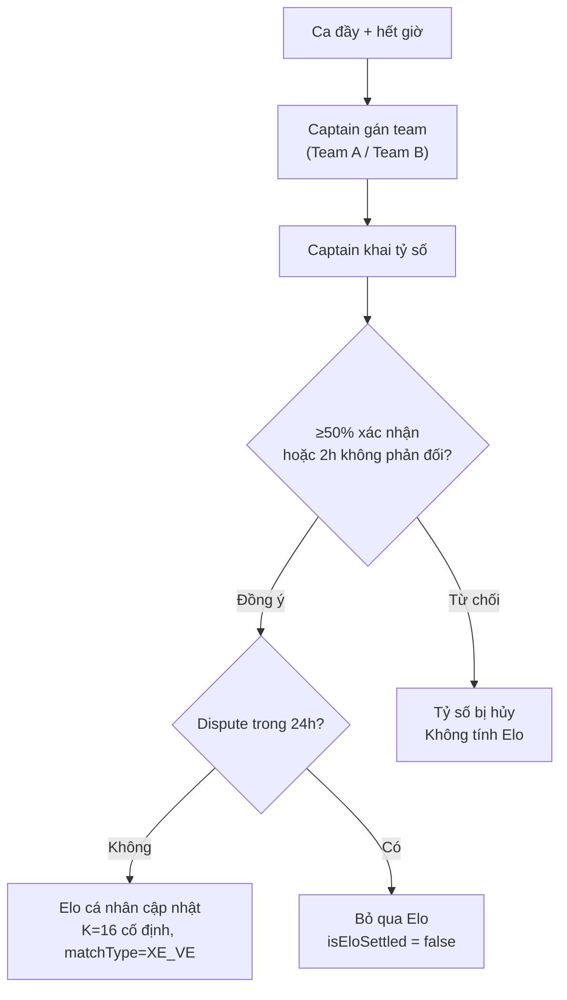

# 🏗️ Sporta — Hệ thống Elo & CRP v2 — BẢN KẾ HOẠCH FINAL

> **Trạng thái**: Đã chốt, sẵn sàng implement.
> **Tổng hợp từ**: `crp_elo_audit.md` (audit gốc) + `design_discussion.md` (trả lời open questions) + phiên thảo luận reconciliation cuối cùng.
> **Đối tượng đọc**: AI/dev thực thi (Gemini Flash 3.5-High) — tài liệu này là spec triển khai, không phải tài liệu bàn luận. Mọi quyết định trong đây là **final**, trừ khi ghi rõ "cần dev xác nhận".

---

## 0. Ghi chú quan trọng trước khi code (đọc trước!)

Bản audit gốc và bản thảo luận có **2 mâu thuẫn** đã được xử lý trong tài liệu này:

1. **CRP zero-sum "thuần" vs "bất đối xứng + Pool"** → Chỉ implement **zero-sum thuần** ở Phase 1-2 (mục 3.1 audit gốc). Cơ chế Asymmetric + CRP Pool + Bonus (mục 2E design_discussion) bị **dời sang Phase 3**, KHÔNG implement ngay. Lý do & phân tích ở mục 5.
2. **Xé Vé v2 có tính vào Placement (5 trận) không?** → **Có**, nhưng dùng K=16 cố định (override lịch K=48/24/16 thông thường). Đây là quyết định bổ sung để giải quyết bài toán "người không có CLB làm sao đạt VERIFIED" — vì Xé Vé v2 giờ đã thay thế hoàn toàn khái niệm "Pickup Match" trong audit gốc.

---

## 1. Triết lý thiết kế (không đổi)

> Elo tự khai là điểm khởi đầu (seed), KHÔNG phải điểm chung cuộc. Hệ thống tự động calibrate Elo về đúng thực lực qua kết quả thi đấu thực tế — "Behavioral Elo", không cần con người đánh giá con người (Peer Review bị loại bỏ, xem mục 6).

**Bài toán con gà quả trứng** (Muốn vào CLB tốt → cần Elo cao → cần đấu Ranked → cần có CLB) được giải bằng: CLB có thể mở (`minEloRequired=0`) + Xé Vé v2 là con đường không cần CLB để build Elo cá nhân.

---

## 2. Phân kỳ FINAL (3 phase)

| Phase | Nội dung | Phụ thuộc |
|-------|----------|-----------|
| **Phase 1** | Personal Elo Engine + fix bug CRP hiện tại (race condition, zero-sum thuần, hardcoded Elo, G-Factor) + Lineup/Poll liên kết + Anti-smurf | Không |
| **Phase 2** | Xé Vé v2 (post-match Elo settle) + Badge system (UNVERIFIED/CALIBRATING/VERIFIED) | Cần Phase 1 (PersonalEloEngine, EloStatus) |
| **Phase 3** | CRP Pool + Asymmetric Zero-Sum + Bonus system | Cần dữ liệu telemetry thật từ Phase 1-2 để size Pool đúng (xem mục 5) |

**KHÔNG implement trong bất kỳ phase nào**: Peer Review (PlayerRating), Pickup Match như một entity riêng biệt (đã merge vào Xé Vé v2), Season Reset (chưa cần).

---

## 3. PHASE 1 — Personal Elo Foundation

### 3.1 Mở rộng `UserSport` Entity

```java
@Entity
@Table(name = "user_sports")
public class UserSport {
    // ... existing fields ...

    @Column(name = "elo_rating")
    private Integer eloRating = null; // null = chưa từng đấu, dùng seed từ level

    @Enumerated(EnumType.STRING)
    @Column(name = "elo_status")
    @Builder.Default
    private EloStatus eloStatus = EloStatus.UNVERIFIED;

    @Column(name = "placement_matches_played")
    @Builder.Default
    private Integer placementMatchesPlayed = 0;

    @Column(name = "total_ranked_matches")
    @Builder.Default
    private Integer totalRankedMatches = 0;

    @Column(name = "total_wins")
    @Builder.Default
    private Integer totalWins = 0;

    @Column(name = "last_match_at")
    private LocalDateTime lastMatchAt;

    /** Elo hiệu dụng: nếu chưa có eloRating → dùng seed từ level */
    public int getEffectiveElo() {
        if (eloRating != null) return eloRating;
        return mapSeedElo(level);
    }
}
```

```java
public enum EloStatus {
    UNVERIFIED,   // Chưa đấu trận nào → Elo = seed từ level
    CALIBRATING,  // Đang trong 5 trận Placement → K cao
    VERIFIED      // Đã qua Placement → Elo ổn định
}
```

### 3.2 PersonalEloEngine — chuẩn Elo formula

> **Bổ sung so với audit gốc**: `getKFactor` nhận thêm `matchType` để hỗ trợ Xé Vé override (dùng ở Phase 2, nhưng nên thiết kế signature ngay từ Phase 1 để không phải refactor sau).

```java
public enum MatchType { CLUB_RANKED, XE_VE }

public class PersonalEloEngine {

    public int calculateNewElo(int myElo, int opponentElo, double actualScore, int kFactor) {
        // actualScore: 1.0 = thắng, 0.5 = hòa, 0.0 = thua
        double expectedScore = 1.0 / (1.0 + Math.pow(10, (opponentElo - myElo) / 400.0));
        return (int) Math.round(myElo + kFactor * (actualScore - expectedScore));
    }

    public int getKFactor(UserSport userSport, MatchType matchType) {
        // Xé Vé luôn dùng K=16 cố định — dữ liệu kém tin cậy hơn (chủ sân khai, người lạ)
        if (matchType == MatchType.XE_VE) {
            return 16;
        }
        if (userSport.getEloStatus() == EloStatus.CALIBRATING
            || userSport.getPlacementMatchesPlayed() < 5) {
            return 48; // Placement: biến động mạnh
        }
        if (userSport.getTotalRankedMatches() < 30) {
            return 24; // Mới verified
        }
        return 16; // Veteran
    }
}
```

**Placement counter dùng chung cho cả 2 loại trận** (CLUB_RANKED và XE_VE đều +1 vào `placementMatchesPlayed`) — đây là quyết định bổ sung để giải bài toán chicken-and-egg cho người không có CLB.

### 3.3 CRP Engine — Zero-sum THUẦN (không Pool, không asymmetric)

```java
// Nguyên tắc: winnerGain + loserLoss = 0
int baseDelta = (int) Math.round(winBase * gFactor);
int upsetBonus = upset;

if (winnerIsUnderdog) {
    winnerGain = baseDelta + upsetBonus;
    loserLoss  = -(baseDelta + upsetBonus);
} else {
    winnerGain = Math.max(1, baseDelta - upsetBonus);
    loserLoss  = -winnerGain;
}
```

**Xóa bỏ `lossBase` config** — chỉ giữ `winBase`. Loser mất ĐÚNG BẰNG winner được (không có Pool bù ở phase này).

**Hòa có ý nghĩa**:
```java
if (outcome == NormalizedOutcome.DRAW) {
    int eloDiff = hostElo - guestElo;
    if (Math.abs(eloDiff) < 50) {
        hostDelta = 0; guestDelta = 0;
    } else {
        int drawPenalty = Math.max(1, Math.min(5, Math.abs(eloDiff) / 100));
        // Bên kèo trên hòa = bị trừ nhẹ; bên kèo dưới hòa = được cộng nhẹ
        hostDelta = eloDiff > 0 ? -drawPenalty : +drawPenalty;
        guestDelta = -hostDelta;
    }
}
```

### 3.4 Fix Race Condition CRP (bug nghiêm trọng)

Trong `MatchmakingServiceImpl` (~L735) và `AdminDisputeController` (~L169,177) — cùng pattern:

```diff
- hostClub.setCrp(crpRes.getHostCrpAfter());
+ int currentHostCrp = hostClub.getCrp() != null ? hostClub.getCrp() : 0;
+ hostClub.setCrp(Math.max(0, currentHostCrp + crpRes.getHostCrpDelta()));
```
Đọc CRP hiện tại từ DB real-time rồi cộng delta, thay vì ghi đè giá trị đã tính từ trước (có thể stale nếu có request song song).

### 3.5 Cập nhật Elo cá nhân sau trận CLB Ranked

```java
private void updatePlayerElos(Match match, NormalizedOutcome outcome) {
    List<ClubMember> hostMembers = getLineup(match.getHostClub(), match); // xem 3.7
    List<ClubMember> guestMembers = getLineup(match.getGuestClub(), match);

    int avgHostElo = calculateAvgElo(hostMembers, match.getHostClub().getSport().getId());
    int avgGuestElo = calculateAvgElo(guestMembers, match.getHostClub().getSport().getId());

    for (ClubMember m : hostMembers)
        updateMemberElo(m, avgGuestElo, scoreFor(outcome, true), MatchType.CLUB_RANKED);
    for (ClubMember m : guestMembers)
        updateMemberElo(m, avgHostElo, scoreFor(outcome, false), MatchType.CLUB_RANKED);
}

private void updateMemberElo(ClubMember member, int opponentTeamElo, double score, MatchType type) {
    UserSport us = userSportRepository.findByUserIdAndSportId(member.getUser().getId(), sportId).orElse(null);
    if (us == null) return;

    int newElo = personalEloEngine.calculateNewElo(
        us.getEffectiveElo(), opponentTeamElo, score, personalEloEngine.getKFactor(us, type));

    us.setEloRating(newElo);
    us.setTotalRankedMatches(us.getTotalRankedMatches() + 1);
    if (score == 1.0) us.setTotalWins(us.getTotalWins() + 1);
    us.setLastMatchAt(LocalDateTime.now());

    if (us.getEloStatus() != EloStatus.VERIFIED) {
        us.setEloStatus(EloStatus.CALIBRATING);
        us.setPlacementMatchesPlayed(us.getPlacementMatchesPlayed() + 1);
        if (us.getPlacementMatchesPlayed() >= 5) us.setEloStatus(EloStatus.VERIFIED);
    }
    userSportRepository.save(us);
}
```

### 3.6 Club Elo = Weighted Average

```java
public int getClubElo(Club club) {
    double weightedTotal = 0, totalWeight = 0;
    for (ClubMember member : activeMembers) {
        int memberElo = 1000;
        double weight = 0.5; // base cho UNVERIFIED
        Optional<UserSport> us = userSportRepository.findByUserIdAndSportId(member.getUser().getId(), sportId);
        if (us.isPresent()) {
            memberElo = us.get().getEffectiveElo();
            weight = switch (us.get().getEloStatus()) {
                case VERIFIED -> 1.0;
                case CALIBRATING -> 0.75;
                case UNVERIFIED -> 0.5;
            };
        }
        if (member.getRole() == ClubMemberRole.ADMIN || member.getRole() == ClubMemberRole.SUB_LEADER)
            weight *= 1.2;
        weightedTotal += memberElo * weight;
        totalWeight += weight;
    }
    return totalWeight > 0 ? (int) Math.round(weightedTotal / totalWeight) : 1000;
}
```

### 3.7 Lineup qua ClubPoll (thay vì tất cả APPROVED members)

Thêm `match_id` (hoặc `room_id`) vào `ClubPoll` để biết poll thuộc trận nào.

```java
private List<User> getMatchLineup(Match match, Club club) {
    ClubPoll poll = clubPollRepository.findByClubIdAndMatchId(club.getId(), match.getId()).orElse(null);
    if (poll != null) {
        return clubPollVoteRepository.findByPollIdAndOption(poll.getId(), PollVoteOption.JOIN)
            .stream().map(ClubPollVote::getUser).collect(Collectors.toList());
    }
    // Fallback: không có poll → tất cả APPROVED members (hành vi cũ)
    return clubMemberRepository.findByClubIdAndStatus(club.getId(), ClubMemberStatus.APPROVED)
        .stream().map(ClubMember::getUser).collect(Collectors.toList());
}
```

Admin CLB tạo poll "Ai tham gia trận ngày X?" → thành viên vote JOIN/ABSENT → chỉ người vote JOIN mới bị ảnh hưởng Elo khi `confirmScore()` chạy.

### 3.8 Club mở (`minEloRequired`) — con đường không cần đấu Placement trước

```java
// Club.java — thêm field
private Integer minEloRequired = 0; // 0 = không yêu cầu
private RecruitmentStatus recruitmentStatus = RecruitmentStatus.OPEN; // OPEN, SELECTIVE, CLOSED
```

```java
// ClubMemberServiceImpl.joinClub() — thêm check
if (club.getMinEloRequired() != null && club.getMinEloRequired() > 0) {
    int userElo = userSportRepository.findByUserIdAndSportId(user.getId(), club.getSport().getId())
        .map(UserSport::getEffectiveElo).orElse(1000);
    if (userElo < club.getMinEloRequired()) {
        throw new CustomException("Bạn cần ít nhất " + club.getMinEloRequired()
            + " Elo để gia nhập CLB này (hiện tại: " + userElo + ")", 400);
    }
}
```

### 3.9 Anti-Smurf: check overlap thành viên

```java
private void validateAntiSmurf(Club hostClub, Club guestClub) {
    Set<Long> hostUserIds = hostMembers.stream().map(m -> m.getUser().getId()).collect(Collectors.toSet());
    long overlap = guestMembers.stream().filter(m -> hostUserIds.contains(m.getUser().getId())).count();
    int smallerTeam = Math.min(hostMembers.size(), guestMembers.size());
    double overlapRatio = smallerTeam > 0 ? (double) overlap / smallerTeam : 0;
    if (overlapRatio > 0.3) {
        throw new CustomException("Hai CLB có quá nhiều thành viên trùng nhau ("
            + (int)(overlapRatio * 100) + "%). Không thể đấu Ranked.", 400);
    }
}
```

### 3.10 G-Factor floor thấp hơn (FootballScoreAdapter)

```diff
- double rawG = 0.5 + 0.5 * (margin / scale);
- return Math.max(0.5, Math.min(1.0, rawG));
+ double rawG = 0.25 + 0.75 * (margin / scale);
+ return Math.max(0.25, Math.min(1.5, rawG));
```
→ Thắng sát nút ít CRP hơn (0.60→0.40 cho 1-0), thắng đậm nhiều CRP hơn (1.00→1.30 cho 7-0).

### 3.11 Fix hardcoded `userElo = 1200`

```diff
- Integer userElo = 1200; // Mock ELO
+ Integer userElo = 1000; // Default
+ Optional<UserSport> us = userSportRepository.findByUserIdAndSportId(userId, sportId);
+ if (us.isPresent()) userElo = us.get().getEffectiveElo();
```

### 3.12 DB Migration Phase 1

```sql
ALTER TABLE user_sports ADD COLUMN elo_rating INTEGER DEFAULT NULL;
ALTER TABLE user_sports ADD COLUMN elo_status VARCHAR(20) DEFAULT 'UNVERIFIED';
ALTER TABLE user_sports ADD COLUMN placement_matches_played INTEGER DEFAULT 0;
ALTER TABLE user_sports ADD COLUMN total_ranked_matches INTEGER DEFAULT 0;
ALTER TABLE user_sports ADD COLUMN total_wins INTEGER DEFAULT 0;
ALTER TABLE user_sports ADD COLUMN last_match_at TIMESTAMP DEFAULT NULL;

UPDATE user_sports SET elo_rating = CASE
    WHEN level = 'WEAK' THEN 900
    WHEN level = 'WEAK_AVERAGE' THEN 1200
    WHEN level = 'AVERAGE' THEN 1500
    WHEN level = 'AVERAGE_GOOD' THEN 1800
    WHEN level = 'GOOD' THEN 2100
    ELSE 1000
END WHERE elo_rating IS NULL;

ALTER TABLE clubs ADD COLUMN min_elo_required INTEGER DEFAULT 0;
ALTER TABLE clubs ADD COLUMN recruitment_status VARCHAR(20) DEFAULT 'OPEN';
ALTER TABLE club_polls ADD COLUMN match_id BIGINT DEFAULT NULL;
```

```yaml
# application.yml
ranking.crp:
  win-base: 20        # giảm từ 25
  # loss-base: REMOVED — zero-sum thuần
  upset-step-elo: 50
```

### 3.13 File change table — Phase 1

| File | Loại | Mô tả |
|------|------|-------|
| `UserSport.java` | MODIFY | +eloRating, eloStatus, placementMatchesPlayed, totalRankedMatches, totalWins, lastMatchAt |
| `EloStatus.java` | NEW | Enum UNVERIFIED / CALIBRATING / VERIFIED |
| `MatchType.java` | NEW | Enum CLUB_RANKED / XE_VE (dùng ngay từ Phase 1 để khỏi refactor ở Phase 2) |
| `PersonalEloEngine.java` | NEW | Elo formula chuẩn + K-factor theo matchType |
| `Club.java` | MODIFY | +minEloRequired, recruitmentStatus |
| `RecruitmentStatus.java` | NEW | Enum OPEN / SELECTIVE / CLOSED |
| `ClubPoll.java` | MODIFY | +match_id (liên kết poll ↔ trận) |
| `ClubEloService.java` | MODIFY | Weighted average thay simple average |
| `CRPEngine.java` | MODIFY | Zero-sum thuần, hòa có ý nghĩa |
| `MatchmakingServiceImpl.java` | MODIFY | Fix race condition, updatePlayerElos(), getMatchLineup(), anti-smurf |
| `AdminDisputeController.java` | MODIFY | Fix race condition (cùng pattern) |
| `ClubMemberServiceImpl.java` | MODIFY | Check minEloRequired, fix hardcoded userElo=1200 |
| `FootballScoreAdapter.java` | MODIFY | G-Factor floor 0.25 |
| `MatchmakingConfig.java` | MODIFY | Xóa lossBase, thêm K-factor configs |

---

## 4. PHASE 2 — Xé Vé v2 (Post-match Elo) + Badge System

### 4.1 Quyết định thiết kế: mở rộng Xé Vé, không tách Pickup riêng

Xé Vé hiện tại đã là pickup match về bản chất (người lạ ghép sân) — chỉ thiếu khai tỷ số + tính Elo. Tách riêng "Pickup" sẽ duplicate logic và gây confuse user.

**Không cần Peer Review cho Xé Vé** — người lạ, không có động lực đánh giá công tâm.

### 4.2 Mở rộng `TicketSession`

```java
@Column(name = "host_score") private String hostScore;
@Column(name = "guest_score") private String guestScore;
@Enumerated(EnumType.STRING)
@Column(name = "match_outcome") private NormalizedOutcome matchOutcome;
@Column(name = "is_elo_settled") @Builder.Default private Boolean isEloSettled = false;
```

### 4.3 ⚠️ Gap cần bổ sung: gán đội cho người mua vé

> [!IMPORTANT]
> **Chủ sân (Owner) KHÔNG tham gia vào việc gán đội hay khai tỷ số.** Owner chỉ có nghĩa vụ tạo ca, quản lý slot, thu tiền. Việc quản lý trận đấu trong ca là trách nhiệm của **người chơi**.

Audit gốc chưa có cơ chế biết **ai thuộc Team A/B** trong số người mua vé — cần để tính Elo trung bình mỗi đội. Đề xuất:

**Cơ chế Captain (Trưởng phòng)**:
- Người **mua vé đầu tiên** trong ca tự động trở thành **Captain** (có thể chuyển nhượng qua UI)
- Captain có quyền: gán team (Team A / Team B), khai tỷ số sau trận
- Các người chơi khác có quyền: tự chọn team (nếu Captain cho phép), flag dispute

```java
// Thêm vào Ticket entity (hoặc entity tương đương)
@Enumerated(EnumType.STRING)
@Column(name = "team")
private TeamSide team; // HOST, GUEST, null = chưa gán

@Column(name = "is_captain")
@Builder.Default
private Boolean isCaptain = false; // true cho người mua vé đầu tiên
```

```java
// Trong logic purchaseTicket() — auto-assign captain
if (session.getBookedSlots() == 0) {
    // Người đầu tiên mua vé → Captain
    ticket.setIsCaptain(true);
}
```

Captain gán đội **trước khi** khai tỷ số. Nếu chưa gán đủ 2 đội → không cho khai tỷ số (validation).

### 4.4 Flow khai tỷ số & dispute

- **Ai khai**: **Captain** (trưởng phòng — người mua vé đầu tiên). Captain gán team → đá xong → khai tỷ số.
- **Xác nhận tỷ số**: Cần ≥50% người chơi trong ca xác nhận (hoặc không ai phản đối trong 2 giờ = tự động chấp nhận). Đây là cơ chế nhẹ hơn so với CLB Ranked (chỉ cần Guest CLB admin confirm), phù hợp vì người lạ không có trust relationship.
- **Dispute**: Bất kỳ người mua vé nào có thể flag dispute trong vòng 24h sau giờ đá. Nếu có dispute → `isEloSettled` giữ `false` vĩnh viễn, không tính Elo cho trận đó. Không cần admin resolution UI ở Phase 2 (để dành cho phase sau nếu có abuse thực tế).
- Xé Vé **không** ảnh hưởng CRP CLB — chỉ ảnh hưởng Elo cá nhân của người tham gia.



### 4.5 Elo settlement cho Xé Vé

```java
private void settleXeVeElo(TicketSession session) {
    List<User> teamHost = getParticipantsByTeam(session, TeamSide.HOST);
    List<User> teamGuest = getParticipantsByTeam(session, TeamSide.GUEST);
    Long sportId = session.getVenue().getSport().getId(); // xác nhận path đúng trong code

    int avgHostElo = calculateAvgElo(teamHost, sportId);
    int avgGuestElo = calculateAvgElo(teamGuest, sportId);

    for (User u : teamHost)
        updateIndividualElo(u, sportId, avgGuestElo, scoreFor(session.getMatchOutcome(), true), MatchType.XE_VE);
    for (User u : teamGuest)
        updateIndividualElo(u, sportId, avgHostElo, scoreFor(session.getMatchOutcome(), false), MatchType.XE_VE);

    session.setIsEloSettled(true);
}
// updateIndividualElo dùng chung logic với updateMemberElo (3.5), khác ở MatchType.XE_VE → K=16 cố định,
// vẫn cộng vào placementMatchesPlayed như bình thường.
```

### 4.6 Badge System

| Status | Badge | UI | Ý nghĩa |
|--------|-------|-----|---------|
| `UNVERIFIED` | 🔘 | Elo 1500 *(tự khai)* | Chưa đấu trận nào |
| `CALIBRATING` | ⏳ | Elo 1420 *(3/5 trận)* | Đang Placement |
| `VERIFIED` | ✅ | Elo 1380 ✅ | Elo đáng tin |

Hiển thị ở: Profile cá nhân, `ClubMemberResponse`, Leaderboard, Match detail. Khi CLB yêu cầu Elo tối thiểu → chỉ chấp nhận `VERIFIED`:

```java
if (club.getMinEloRequired() > 0) {
    if (userSport.getEloStatus() != EloStatus.VERIFIED) {
        throw new CustomException("CLB này yêu cầu Elo đã xác minh (VERIFIED). "
            + "Hãy tham gia ít nhất 5 trận (CLB hoặc Xé Vé) để xác minh trình độ.", 400);
    }
    if (userSport.getEffectiveElo() < club.getMinEloRequired()) {
        throw new CustomException("Elo không đủ...", 400);
    }
}
```

### 4.7 File change table — Phase 2

| File | Loại | Mô tả |
|------|------|-------|
| `TicketSession.java` | MODIFY | +hostScore, guestScore, matchOutcome, isEloSettled |
| `Ticket.java` | MODIFY | +team (HOST/GUEST), +isCaptain (auto-assign cho người mua đầu tiên) |
| `TeamSide.java` | NEW | Enum HOST, GUEST |
| `UserTicketService.java` | MODIFY | Thêm assignTeam(), declareScore() (Captain only), confirmScore(), flagDispute(), settleXeVeElo(). Auto-assign captain khi bookedSlots==0 |
| `ClubMemberResponse.java` | MODIFY | +eloStatus, badge display fields |
| Frontend components liên quan profile/leaderboard | MODIFY | Hiển thị badge |


---

## 5. PHASE 3 (Dời lại) — CRP Pool + Asymmetric Zero-Sum + Bonus

### 5.1 Vì sao dời lại

`design_discussion.md` mục 2E đề xuất: Winner luôn được nhiều hơn Loser mất, phần chênh lấy từ CRP Pool; cộng thêm hệ thống Bonus (streak, comeback, daily, weekly) cũng rút từ Pool. Đây là cải tiến UX tốt (giảm loss-aversion), nhưng **sizing Pool lúc này là đoán mò** — nếu đưa "CLB mới +100 CRP từ Pool, Pool khởi điểm 10,000" thẳng vào code, rủi ro là:

- Nếu rút phí tạo CLB từ Pool: outflow tỉ lệ với **tốc độ tăng trưởng người dùng**, không kiểm soát được.
- Ngay cả khi tách phí tạo CLB ra khỏi Pool (đề xuất), riêng outflow từ subsidy mỗi trận (~6-8 CRP) + bonus (~2-3 CRP trung bình) cũng làm Pool 10,000 cạn trong khoảng 700-2000 trận tùy mức bonus — với 1 platform mới, đây có thể chỉ là vài tuần đến vài tháng.

### 5.2 Điều kiện để bắt đầu Phase 3

1. Đã có ≥ 4-8 tuần dữ liệu telemetry thật từ Phase 1-2 (số trận Ranked/tuần, số CLB mới/tuần).
2. Tách rõ 2 luồng: **CLB mới nhận CRP khởi điểm = mint trực tiếp** (không rút Pool, tương tự Elo seed) vs **Pool chỉ tài trợ subsidy + bonus mỗi trận** (outflow tỉ lệ số trận, dự đoán được).
3. Size Pool theo công thức: `Pool = runway_tuần_mong_muốn × trận/tuần_thực_tế × outflow_TB/trận`.
4. Xây dashboard admin theo dõi Pool real-time + cảnh báo trước khi cạn.
5. Cơ chế refund Pool: quyết định giữa "nạp định kỳ theo tay admin" hay "CRP decay của CLB không hoạt động chảy về Pool" — cần thêm 1 vòng thảo luận riêng, chưa chốt.

### 5.3 Spec giữ nguyên để implement khi đủ điều kiện (không đổi so với design_discussion)

```java
int rawDelta = (int) Math.round(winBase * gFactor);
int winnerGain = rawDelta;
int loserLoss = (int)(rawDelta * 0.7);        // chỉ mất 70%
int poolSubsidy = winnerGain - loserLoss;     // pool bù phần còn lại

if (winnerIsUnderdog) {
    winnerGain += upset;
    loserLoss += upset;
}
```

Bonus system (streak +5, first-match-of-day +3, comeback +5, weekly-activity +5) — giữ nguyên spec gốc, lấy từ Pool, không ảnh hưởng đối thủ.

---

## 6. Đã loại bỏ / không implement

| Hạng mục | Lý do |
|----------|-------|
| **Peer Review** (rate đối thủ 1-5 sao) | Griefing khó phát hiện, sample size quá nhỏ (2-3 người rate/trận), thay bằng Behavioral Elo tự calibrate qua Placement |
| **Pickup Match như entity riêng** | Merge vào Xé Vé v2, tránh duplicate logic |
| **Season Reset** | Chưa cần ở giai đoạn này, revisit sau Phase 3 khi có dữ liệu về CLB lâu năm vs CLB mới |

---

## 7. Tóm tắt quyết định (tổng hợp toàn bộ 3 phase)

| Câu hỏi | Quyết định final |
|---------|-------------------|
| Pickup vs Xé Vé | Mở rộng Xé Vé v2 (Phase 2) |
| Ai khai tỷ số Xé Vé | Captain (người mua vé đầu tiên), ≥50% confirm hoặc auto-accept 2h, dispute window 24h |
| Xé Vé có tính Placement? | Có, nhưng K=16 cố định (không theo lịch 48/24/16) |
| Lineup | ClubPoll liên kết Match qua match_id (Phase 1) |
| Peer Review | Bỏ hẳn |
| Đa môn | Chung 1 hệ Elo, tách per UserSport row |
| CRP zero-sum | Thuần ở Phase 1-2; Asymmetric+Pool dời Phase 3 |
| CRP Pool sizing | Không chốt số cứng — đo telemetry thật rồi tính (Phase 3) |
| Badge | UNVERIFIED / CALIBRATING / VERIFIED (Phase 2) |
| Season Reset | Chưa làm |

---

## 8. Ghi chú triển khai cho AI thực thi (Gemini Flash 3.5-High)

1. **Thứ tự bắt buộc**: Phase 1 → Phase 2. Không bắt đầu Phase 3 cho tới khi có xác nhận từ người yêu cầu kèm dữ liệu telemetry thật.
2. **Backward compatibility**: Toàn bộ cột DB mới đều nullable/có default → không phá dữ liệu cũ. Xem migration ở mục 3.12.
3. **Trước khi code Phase 2 mục 4.3**: cần đọc code thật của entity đại diện người mua vé trong `UserTicketService`/`TicketSession` để xác nhận tên chính xác — tài liệu này chỉ đưa ra thiết kế logic, tên field/class có thể lệch với codebase thật.
4. **Test bắt buộc**: unit test cho `PersonalEloEngine.calculateNewElo()` với các case biên (Elo bằng nhau, chênh lệch lớn, K khác nhau), test race condition CRP bằng concurrent requests giả lập, test zero-sum invariant (`winnerGain + loserLoss == 0`) sau mỗi trận.
5. **Không tự ý implement** mục 5 (CRP Pool) — nếu thấy code liên quan đến Pool/Bonus trong quá trình làm Phase 1-2, bỏ qua, để dành Phase 3.
