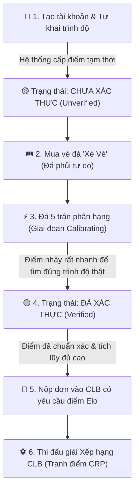
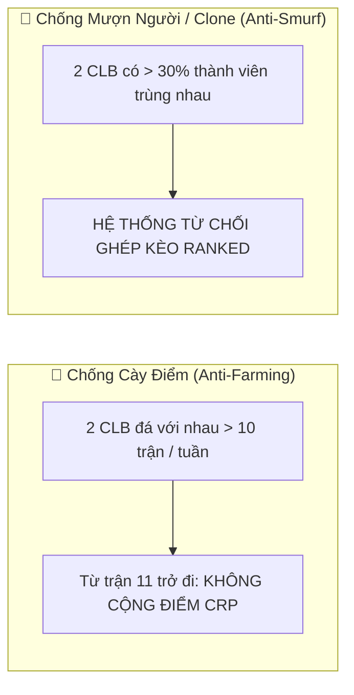

# 🏆 HƯỚNG DẪN DỄ HIỂU VỀ HỆ THỐNG ĐIỂM ELO CÁ NHÂN & ĐIỂM XẾP HẠNG CLB (CRP)
> *Dành cho tất cả mọi người — Không yêu cầu kiến thức lập trình!*

---

## 📌 PHẦN 1: BÀI TOÁN THỰC TẾ & VÌ SAO PHẢI CẢI TIẾN?

Hãy tưởng tượng bạn vừa tham gia một ứng dụng thể thao:
1. **Lúc đăng ký**, ứng dụng hỏi: *"Bạn đá bóng trình độ nào?"*. Bạn tự chọn "Trung bình Khá". Nhưng làm sao hệ thống biết bạn tự tin thái quá hay thực sự đá giỏi?
2. **Một Câu lạc bộ (CLB) mạnh** đặt điều kiện: *"Chỉ nhận người có điểm trình độ từ 1,500 trở lên"*. Bạn muốn vào CLB đó nhưng hiện tại chưa có CLB nào nhận bạn để bạn thi đấu tính điểm. Vậy bạn lấy đâu ra điểm để chứng minh bản thân?
3. **Chủ sân bóng** chỉ muốn cho thuê sân và thu tiền, họ không có thời gian và trách nhiệm đi làm trọng tài, nhập tỷ số hay phân xử xem ai thắng ai thua.

👉 **Hệ thống Elo & CRP v2 ra đời để giải quyết triệt để 3 vấn đề trên!**

---

## 🧭 PHẦN 2: PHÂN BIỆT HAI LOẠI ĐIỂM KHÁC NHAU

Trong hệ thống Sporta, có **2 loại điểm hoàn toàn tách biệt**:

```
                  ┌────────────────────────────────────────┐
                  │          HỆ THỐNG ĐIỂM SPORTA          │
                  └───────────────────┬────────────────────┘
                                      │
           ┌──────────────────────────┴──────────────────────────┐
           ▼                                                     ▼
┌───────────────────────────────┐             ┌───────────────────────────────┐
│     ĐIỂM ELO CÁ NHÂN (Elo)    │             │   ĐIỂM XẾP HẠNG CLB (CRP)     │
│  (Thước đo trình độ cá nhân)  │             │   (Thành tích đua top của CLB)│
├───────────────────────────────┤             ├───────────────────────────────┤
│ • Gắn liền với từng người     │             │ • Gắn liền với cả tập thể CLB │
│ • Tính riêng theo từng môn    │             │ • Dùng để xếp hạng mùa giải   │
│ • Thay đổi sau MỌI trận đấu   │             │ • Đội thắng nhận từ đội thua  │
│   (Đá xé vé lẻ hoặc đá cho CLB│             │ • Bảo toàn tổng (Zero-Sum)    │
└───────────────────────────────┘             └───────────────────────────────┘
```

---

## 🚀 PHẦN 3: HÀNH TRÌNH CỦA MỘT NGƯỜI CHƠI MỚI

Làm sao một người chơi tự khai trình độ có thể đưa điểm về đúng thực tế và gia nhập CLB mơ ước?



### 1. Bước 1: Khởi đầu (Tự khai)
- Người chơi đăng ký môn Thể thao và tự chọn mức độ (Yếu, Trung bình, Khá, Giỏi...).
- Hệ thống sẽ tạm gán một mức điểm mẫu (ví dụ: Trung bình = 1,500 điểm).
- Lúc này, điểm mang nhãn **"Chưa xác thực" (UNVERIFIED)**. Điểm này chưa đủ uy tín để vào các CLB yêu cầu khắt khe.

### 2. Bước 2: Đá lẻ tự do ("Xé vé") để rèn luyện
- Người chơi không cần CLB vẫn có thể ra sân bằng tính năng **Xé Vé** (sân mở ca đá phủi, người lạ vào ghép đội).
- Mỗi trận xé vé đều được tính điểm Elo cá nhân.

### 3. Bước 3: 5 trận "Phân hạng thần tốc" (Placement Matches)
- Trong 5 trận đầu tiên, hệ thống kích hoạt chế độ **"Độ nhạy cực cao" ($K = 48$)**.
- Nếu bạn tự khai giỏi mà đá thua người yếu $\rightarrow$ Điểm bị trừ cực mạnh để tụt về đúng thực lực.
- Nếu bạn đá hay vượt trội $\rightarrow$ Điểm tăng vọt nhanh chóng.
- **Sau đúng 5 trận**, hệ thống gắn huy hiệu **"Đã xác thực" (VERIFIED)**. Điểm của bạn giờ đây đã phản ánh chính xác thực lực.

### 4. Bước 4: Bước chân vào Câu lạc bộ
- Khi đã có điểm Elo xác thực và đạt mốc CLB yêu cầu (ví dụ: CLB yêu cầu tối thiểu 1,400 điểm), bạn bấm "Xin gia nhập" và được duyệt ngay!

---

## 🎟️ PHẦN 4: LUỒNG "XÉ VÉ" MỚI — KHÔNG CẦN CHỦ SÂN CAN THIỆP

Trước đây, chủ sân phải làm nhiều việc phiền toái. Nay hệ thống chuyển sang mô hình **Trưởng Ca Tự Quản (Captain Model)**:

```
                      ┌─────────────────────────────────┐
                      │    1. ĐẶT VÉ TRỰC TUYẾN         │
                      │ Người đầu tiên mua vé trong ca  │
                      │ được chọn làm TRƯỞNG CA         │
                      └────────────────┬────────────────┘
                                       │
                                       ▼
                      ┌─────────────────────────────────┐
                      │    2. RA SÂN & CHIA ĐỘI         │
                      │ Mọi người quét QR vào sân       │
                      │ Trưởng ca chia Đội Xanh / Cam   │
                      └────────────────┬────────────────┘
                                       │
                                       ▼
                      ┌─────────────────────────────────┐
                      │    3. BÁO CÁO KẾT QUẢ           │
                      │ Trưởng ca nhập tỷ số trận đấu   │
                      └────────────────┬────────────────┘
                                       │
                                       ▼
                      ┌─────────────────────────────────┐
                      │    4. XÁC NHẬN DÂN CHỦ          │
                      │ Các người chơi khác bấm ĐỒNG Ý  │
                      └────────────────┬────────────────┘
                                       │
                                       ▼
                      ┌─────────────────────────────────┐
                      │    5. CẬP NHẬT ELO TỰ ĐỘNG      │
                      │ Đủ xác nhận -> Cộng/Trừ Elo     │
                      │ (Nếu có gian lận -> Bấm Khiếu nại)│
                      └─────────────────────────────────┘
```

1. **Trưởng ca là ai?** Người đầu tiên đặt vé cho ca đá đó sẽ tự động mang vai trò Trưởng ca.
2. **Chia đội:** Trưởng ca gom các thành viên thành Đội Xanh (Chủ nhà) và Đội Cam (Khách).
3. **Khai báo tỷ số:** Sau khi đá xong, Trưởng ca mở app nhập tỷ số (ví dụ: Xanh 5 - 3 Cam).
4. **Xác nhận dân chủ:** Các bạn cùng chơi thấy thông báo tỷ số trên điện thoại và bấm "Xác nhận đúng".
5. **Cộng trừ điểm tức thì:** Khi đủ người xác nhận, điểm Elo cá nhân của từng người lập tức nhảy số.

---

## 🧮 PHẦN 5: ĐIỂM ELO CÁ NHÂN TĂNG/GIẢM NHƯ THẾ NÀO?

Hệ thống sử dụng nguyên lý công bằng quốc tế:

### Nguyên tắc 1: Đánh bại đối thủ mạnh được nhiều điểm hơn
- **Thắng "Kèo trên" (Đối thủ trình cao hơn bạn):** Bạn được cộng **rất nhiều điểm**, đối thủ bị trừ nhiều.
- **Thắng "Kèo dưới" (Đối thủ yếu hơn bạn nhiều):** Bạn chỉ được cộng **rất ít điểm** (vì thắng là điều bình thường).
- **Trận hòa:** Nếu bạn yếu hơn mà cầm hòa được đối thủ mạnh, bạn vẫn được cộng nhẹ điểm thưởng!

### Nguyên tắc 2: Tốc độ thay đổi điểm (Hệ số K)
- **Người mới (Dưới 5 trận):** Điểm thay đổi **Cực Nhanh** ($\pm 20$ đến $45$ điểm/trận) để mau chóng về đúng trình độ.
- **Người đang tiến bộ (Dưới 30 trận):** Điểm thay đổi **Vừa Phải** ($\pm 10$ đến $24$ điểm/trận).
- **Lão tướng (Đã đá trên 30 trận):** Điểm **Ổn Định** ($\pm 5$ đến $16$ điểm/trận), không bị trồi sụt thất thường.
- **Trận Xé vé giao lưu:** Luôn áp dụng mức thay đổi nhẹ nhàng để khuyến khích tinh thần thể thao vui vẻ.

---

## 🛡️ PHẦN 6: ĐIỂM CLB (CRP), QUỸ THƯỞNG CRP POOL & HỆ THỐNG BONUS

Khi hai CLB thách đấu nhau trong giải **Xếp Hạng (Ranked)**, hệ thống áp dụng cơ chế **Bất Đối Xứng Thông Minh (Asymmetric Loss Dampening)** kết hợp **Quỹ Thưởng Nền Tảng (CRP Reward Pool)** để vừa công bằng, vừa tạo động lực tối đa cho người chơi:

```
┌─────────────────────────────────────────────────────────────────────────────────┐
│                      🏦 QUỸ THƯỞNG NỀN TẢNG (CRP REWARD POOL)                   │
│         (Nguồn quỹ điểm dồi dào tài trợ cho các trận đấu & sự kiện)             │
└───────────────────────┬─────────────────────────────────┬───────────────────────┘
                        │                                 │
         [1. Trợ cấp Giảm trừ Điểm thua 30%]   [2. Phát Điểm Thưởng Bonus]
                        │                                 │
                        ▼                                 ▼
         ┌─────────────────────────────┐   ┌─────────────────────────────┐
         │ ĐỘI THUA (Giảm áp lực)      │   │ ĐỘI THẮNG (Tăng hưng phấn)  │
         │ • Chỉ bị trừ 70% số điểm    │   │ • Nhận 100% điểm thắng      │
         │ • 30% chênh lệch do Pool bù │   │ • +5 CRP Chuỗi thắng (🔥)   │
         │ • Không sợ nản khi thua     │   │ • +3 CRP Trận đầu ngày (🌅) │
         └─────────────────────────────┘   └─────────────────────────────┘
```

### 1. Cơ Chế Giảm Trừ Điểm Thua (Loss Dampening 70%): Thua Không Sợ Mất Hết!
- Trong giai đoạn đầu, các CLB thường rất ngại đấu vì **"sợ thua mất điểm"**.
- **Giải pháp:** Khi một trận đấu kết thúc, **đội thua chỉ bị trừ 70% số điểm cược**.
- **Ví dụ:** Trận đấu trị giá 20 điểm:
  - Đội thắng nhận trọn vẹn: **+20 điểm**.
  - Đội thua chỉ bị trừ: **-14 điểm** (thay vì -20).
  - **Phần 6 điểm chênh lệch ở đâu ra?** Do **Quỹ CRP Pool của hệ thống tự động tài trợ bù vào**!

### 2. Hệ Thống Thưởng (Bonus System) Rút Từ Quỹ CRP Pool
Đội thắng được thưởng thêm nhiều phần quà điểm số từ Quỹ Pool:
- 🔥 **Thưởng Chuỗi Thắng (Win Streak Bonus):** CLB thắng liên tiếp từ 3 trận trở lên $\rightarrow$ Thưởng thêm ngay **+5 điểm CRP** mỗi trận!
- 🌅 **Thưởng Trận Đầu Tiên Trong Ngày (Daily Match Bonus):** Trận Ranked đầu tiên trong ngày $\rightarrow$ Thưởng thêm **+3 điểm CRP** để khuyến khích sinh hoạt thường xuyên.
- ⚡ **Thưởng Lật Kèo (Underdog Upset Bonus):** Đội yếu hơn xuất sắc đánh bại đội mạnh hơn $\rightarrow$ Thưởng thêm điểm Upset cực đậm từ Quỹ Pool.

### 3. Bảo Vệ Đội Thắng Khi Đối Thủ "Chạm Đáy" (0 Điểm)
- Nếu đội thua chỉ còn 5 điểm (hoặc 0 điểm): Họ chỉ bị trừ 5 điểm về 0 (không bao giờ bị âm).
- **Đội thắng vẫn nhận đủ 100% điểm thắng (+20 điểm)** vì toàn bộ phần thiếu được **Quỹ CRP Pool bảo lãnh chi trả**! Đội thắng không bao giờ bị thiệt thòi.

### 4. Hai Tấm Khiên Chống Gian Lận (Anti-Cheat)



- **Chống Cày Điểm (Anti-Farming):** Hai CLB thân quen không thể hẹn nhau đá liên tục 20 trận để "bơm điểm" cho nhau. Trong 7 ngày, tối đa chỉ được tính điểm 10 trận.
- **Chống Đội Hình Ma (Anti-Smurf):** Nếu một nhóm bạn lập ra 2 CLB khác nhau để tự đá tự thắng, hệ thống phát hiện nếu danh sách người chơi trùng nhau $> 30\%$ sẽ **khóa ngay** không cho ghép trận Xếp hạng.
- **Đội hình theo Biểu Quyết (Club Poll):** Chỉ những thành viên nào có mặt trên sân (bấm "Tham gia" Poll) mới được cập nhật điểm Elo sau trận.

---

## 📊 BẢNG TỔNG KẾT: TRƯỚC VÀ SAU KHI CẢI TIẾN

| Tiêu chí | Hệ thống Cũ (v1) | Hệ thống Mới (v2 với CRP Pool & Bonus) |
|---|---|---|
| **Người mới chưa có CLB** | Bị kẹt, không thể thi đấu tăng điểm | Tự do đá Xé Vé để tích lũy điểm và được cấp chứng nhận |
| **Điểm tự khai ban đầu** | Bị sai lệch mãi mãi, không tự sửa được | Tự động cân chỉnh về đúng thực tế sau 5 trận đầu tiên |
| **Vai trò Chủ sân** | Phải nhập tỷ số, dễ gây trễ và sai sót | Hoàn toàn giải phóng! Trưởng ca và người chơi tự quản |
| **Tâm lý sợ thua điểm CLB** | Thua bị trừ 100% điểm, dễ nản lòng | Đội thua chỉ mất 70%, Quỹ CRP Pool trợ cấp bù 30% |
| **Khuyến khích thi đấu** | Không có thưởng thêm | Thưởng chuỗi thắng (+5), thưởng trận đầu ngày (+3), thưởng lật kèo |
| **Gặp đối thủ 0 điểm** | Đội thắng bị hụt điểm | Đội thắng nhận trọn vẹn điểm nhờ Quỹ Pool bảo lãnh |
| **Gian lận / Cày điểm** | Chưa có cơ chế ngăn chặn | Chặn đứng hành vi cày điểm thân quen và mượn người |
| **Hòa trận đấu** | Bị bỏ qua, không tính điểm | Đội yếu hơn cầm hòa đội mạnh được thưởng điểm khích lệ |

---

## 🎉 LỜI KẾT

Hệ thống mới mang lại một sân chơi **minh bạch, công bằng, tự động hóa 100%**, giúp:
- **Người chơi tự do:** Luôn tìm được đối thủ ngang tầm và có lộ trình phát triển rõ ràng.
- **Chủ Câu lạc bộ:** Tuyển chọn được đúng tài năng thực chất thông qua chỉ số đã xác thực.
- **Chủ sân:** Thảnh thơi kinh doanh mà không phải bận tâm làm trọng tài hay xử lý tranh chấp.
