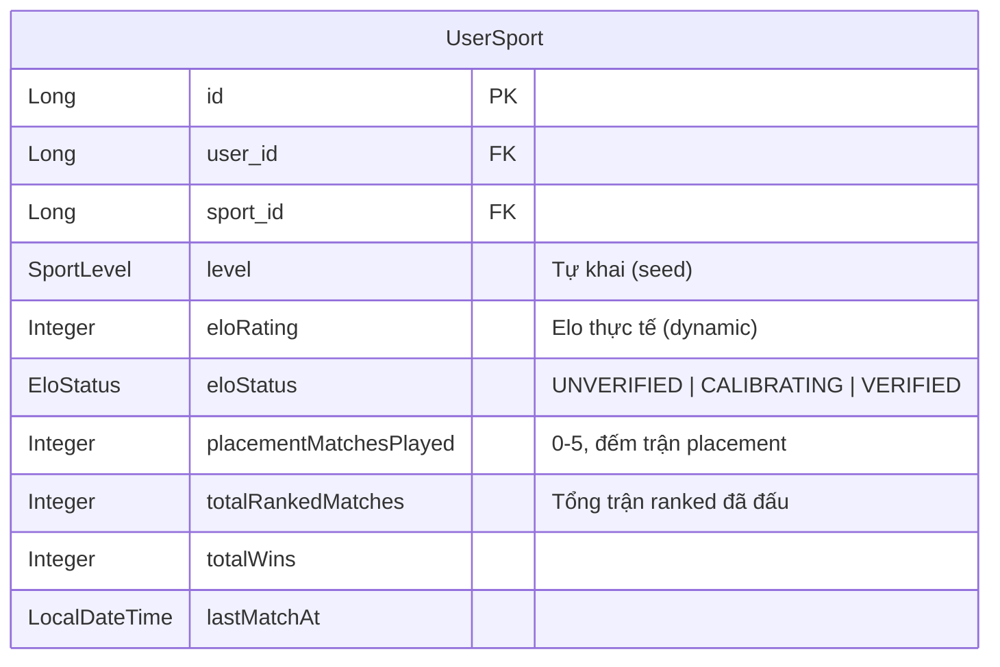
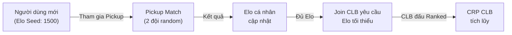
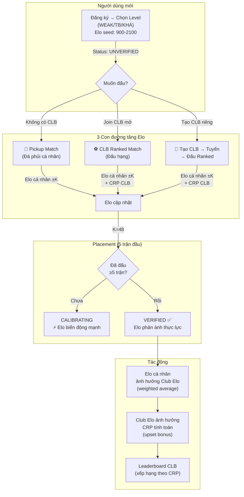

# 🏗️ Thiết kế Giải pháp Toàn diện: Hệ thống Elo & CRP v2

## Bối cảnh & Vấn đề cốt lõi

### Bài toán "Con gà Quả trứng" 🐔🥚

```
Muốn vào CLB tốt → Cần Elo cao
Muốn Elo cao → Cần đấu trận Ranked
Muốn đấu Ranked → Cần có CLB
→ Deadlock!
```

**Hiện trạng code**: [ClubMemberServiceImpl](file:///c:/Users/buida/sporta-platform/backend/sporta/src/main/java/com/backend/sporta/service/ClubMemberServiceImpl.java) - Không check Elo khi join, nhưng dự định tương lai sẽ check → cần giải quyết từ bây giờ.

---

## Triết lý thiết kế

> **Elo tự khai là điểm khởi đầu (seed), KHÔNG phải điểm chung cuộc.** Hệ thống sẽ tự động calibrate Elo về đúng thực lực thông qua kết quả thi đấu thực tế, bất kể người dùng có CLB hay không.

---

## Phần 1: Hệ thống Elo Cá nhân (Personal Elo)

### 1.1 Mở rộng UserSport Entity



**Thay đổi trong** [UserSport.java](file:///c:/Users/buida/sporta-platform/backend/sporta/src/main/java/com/backend/sporta/entity/UserSport.java):

```java
@Entity
@Table(name = "user_sports")
public class UserSport {
    // ... existing fields ...
    
    @Column(name = "elo_rating")
    @Builder.Default
    private Integer eloRating = null; // null = chưa từng đấu, dùng seed từ level
    
    @Enumerated(EnumType.STRING)
    @Column(name = "elo_status")
    @Builder.Default
    private EloStatus eloStatus = EloStatus.UNVERIFIED;
    
    @Column(name = "placement_matches_played")
    @Builder.Default
    private Integer placementMatchesPlayed = 0;
    
    @Column(name = "total_ranked_matches")
    @Builder.Default
    private Integer totalRankedMatches = 0;
    
    @Column(name = "total_wins")
    @Builder.Default
    private Integer totalWins = 0;
    
    @Column(name = "last_match_at")
    private LocalDateTime lastMatchAt;
    
    /** Trả về Elo hiệu dụng: nếu chưa có eloRating → dùng seed từ level */
    public int getEffectiveElo() {
        if (eloRating != null) return eloRating;
        return mapSeedElo(level); // fallback
    }
}
```

### 1.2 Enum EloStatus

```java
public enum EloStatus {
    UNVERIFIED,   // Mới đăng ký, chưa đấu trận nào → Elo = seed từ level
    CALIBRATING,  // Đang trong 5 trận Placement → K-factor cao (K=48)
    VERIFIED      // Đã qua Placement → Elo ổn định (K=24 hoặc K=16)
}
```

### 1.3 Cơ chế Placement (Calibration)

```
Trận 1-5: K = 48 (biến động mạnh, nhanh tìm đúng vị trí)
  → Sau trận 5: status chuyển CALIBRATING → VERIFIED
  
Trận 6-30: K = 24 (giảm dần)
Trận 31+: K = 16 (ổn định)
```

**Logic tính Elo cá nhân sau mỗi trận** (chuẩn Elo formula):

```java
public class PersonalEloEngine {
    
    public int calculateNewElo(int myElo, int opponentElo, double actualScore, int kFactor) {
        // actualScore: 1.0 = thắng, 0.5 = hòa, 0.0 = thua
        double expectedScore = 1.0 / (1.0 + Math.pow(10, (opponentElo - myElo) / 400.0));
        return (int) Math.round(myElo + kFactor * (actualScore - expectedScore));
    }
    
    public int getKFactor(UserSport userSport) {
        if (userSport.getEloStatus() == EloStatus.CALIBRATING 
            || userSport.getPlacementMatchesPlayed() < 5) {
            return 48; // Placement: biến động mạnh
        }
        if (userSport.getTotalRankedMatches() < 30) {
            return 24; // Mới verified: biến động trung bình
        }
        return 16; // Veteran: ổn định
    }
}
```

---

## Phần 2: Giải quyết Chicken-and-Egg — 3 con đường tăng Elo

### 2.1 Con đường 1: Open Pickup Match (Đá phủi / Giao hữu cá nhân)

> **Concept**: Người dùng KHÔNG CẦN CLB, có thể tham gia trận "đá phủi" (pickup game) để tích lũy Elo cá nhân.



**Cách hoạt động**:
- Host tạo "Phòng Pickup" → chọn sân, giờ, số người (10 người cho bóng đá)
- Người dùng đơn lẻ xin vào phòng (không cần CLB)
- Host chia 2 đội → đấu → khai tỷ số → Elo cá nhân cập nhật
- **Elo thay đổi**: Dựa trên trung bình Elo của đội đối thủ vs đội mình

> [!NOTE]
> **Phân biệt**: Pickup Match chỉ ảnh hưởng **Elo cá nhân**, KHÔNG ảnh hưởng CRP CLB.

### 2.2 Con đường 2: Join CLB mở (Open Club) 

> **Concept**: CLB có thể đặt `minEloRequired = 0` (không yêu cầu) → Ai cũng join được → Đá Ranked cho CLB → Elo cá nhân tăng theo.

**Thêm vào** [Club.java](file:///c:/Users/buida/sporta-platform/backend/sporta/src/main/java/com/backend/sporta/entity/Club.java):

```java
@Column(name = "min_elo_required")
@Builder.Default
private Integer minEloRequired = 0; // 0 = không yêu cầu

@Column(name = "recruitment_status")
@Enumerated(EnumType.STRING)
@Builder.Default
private RecruitmentStatus recruitmentStatus = RecruitmentStatus.OPEN;
// OPEN (ai cũng vào), SELECTIVE (cần Elo), CLOSED (không tuyển)
```

**Logic join CLB (cập nhật** [ClubMemberServiceImpl.joinClub()](file:///c:/Users/buida/sporta-platform/backend/sporta/src/main/java/com/backend/sporta/service/ClubMemberServiceImpl.java#L39-L78)**):**

```java
public ClubMemberResponse joinClub(Long clubId, String userEmail) {
    // ... existing checks ...
    
    // NEW: Check Elo requirement
    if (club.getMinEloRequired() != null && club.getMinEloRequired() > 0) {
        UserSport userSport = userSportRepository
            .findByUserIdAndSportId(user.getId(), club.getSport().getId())
            .orElse(null);
        
        int userElo = (userSport != null) ? userSport.getEffectiveElo() : 1000;
        
        if (userElo < club.getMinEloRequired()) {
            throw new CustomException(
                "Bạn cần ít nhất " + club.getMinEloRequired() 
                + " Elo để gia nhập CLB này (Elo hiện tại: " + userElo + ")", 400);
        }
    }
    
    // ... continue existing flow ...
}
```

### 2.3 Con đường 3: Peer Review sau trận (Future)

> Sau mỗi trận, đồng đội và đối thủ có thể rate trình độ thực tế của nhau (1-5 sao). Nếu nhiều người đánh giá thấp → Elo điều chỉnh giảm. Ngăn khai man level.

**Tạm không implement trong phase 1**, nhưng thiết kế DB sẵn:

```java
@Entity
public class PlayerRating {
    UUID id;
    UUID matchId;
    Long raterUserId;    // Người đánh giá
    Long ratedUserId;    // Người được đánh giá
    Integer skillRating; // 1-5
    String comment;
    LocalDateTime createdAt;
}
```

---

## Phần 3: Sửa toàn bộ CRP Engine

### 3.1 Zero-Sum CRP (Fix lạm phát)

**Nguyên tắc**: `winnerGain + loserLoss = 0` (tổng CRP hệ thống không đổi)

```java
// TRƯỚC (Lạm phát):
int winnerGain = Math.max(1, (int) Math.round(winBase * gFactor ± upset)); // +25
int loserLoss  = Math.max(1, (int) Math.round(lossBase * gFactor ± upset)); // -15
// Net: +10 mỗi trận!

// SAU (Zero-sum):
int baseDelta = (int) Math.round(winBase * gFactor);
int upsetBonus = upset; // Bonus/penalty dựa trên chênh lệch Elo

if (winnerIsUnderdog) {
    winnerGain = baseDelta + upsetBonus;
    loserLoss  = -(baseDelta + upsetBonus); // CÙNG giá trị tuyệt đối
} else {
    winnerGain = Math.max(1, baseDelta - upsetBonus);
    loserLoss  = -winnerGain; // CÙNG giá trị tuyệt đối
}
```

> [!IMPORTANT]  
> Xóa bỏ `lossBase` config — chỉ giữ `winBase`. Loser mất ĐÚNG BẰNG winner được.

### 3.2 Hòa có ý nghĩa

```java
if (outcome == NormalizedOutcome.DRAW) {
    int eloDiff = hostElo - guestElo;
    
    if (Math.abs(eloDiff) < 50) {
        // Elo gần bằng nhau → Hòa không ai được/mất
        hostDelta = 0;
        guestDelta = 0;
        explanation.add("Hòa (Elo ngang nhau) - CRP không đổi.");
    } else if (eloDiff > 0) {
        // Host mạnh hơn, hòa = Host thua kỳ vọng, Guest vượt kỳ vọng
        int drawPenalty = Math.max(1, Math.min(5, Math.abs(eloDiff) / 100));
        hostDelta = -drawPenalty;
        guestDelta = +drawPenalty; // Zero-sum
        explanation.add("Hòa (Host kèo trên): Host -" + drawPenalty + ", Guest +" + drawPenalty);
    } else {
        // Guest mạnh hơn
        int drawPenalty = Math.max(1, Math.min(5, Math.abs(eloDiff) / 100));
        hostDelta = +drawPenalty;
        guestDelta = -drawPenalty;
        explanation.add("Hòa (Guest kèo trên): Host +" + drawPenalty + ", Guest -" + drawPenalty);
    }
}
```

### 3.3 Fix Race Condition CRP (Critical Bug)

**Trong** [MatchmakingServiceImpl:735](file:///c:/Users/buida/sporta-platform/backend/sporta/src/main/java/com/backend/sporta/service/MatchmakingServiceImpl.java#L734-L748):

```diff
- hostClub.setCrp(crpRes.getHostCrpAfter());
+ // Đọc CRP hiện tại từ DB (real-time), cộng delta
+ int currentHostCrp = hostClub.getCrp() != null ? hostClub.getCrp() : 0;
+ hostClub.setCrp(Math.max(0, currentHostCrp + crpRes.getHostCrpDelta()));

- guestClub.setCrp(crpRes.getGuestCrpAfter());
+ int currentGuestCrp = guestClub.getCrp() != null ? guestClub.getCrp() : 0;
+ guestClub.setCrp(Math.max(0, currentGuestCrp + crpRes.getGuestCrpDelta()));
```

**Đồng thời fix cả** [AdminDisputeController:169,177](file:///c:/Users/buida/sporta-platform/backend/sporta/src/main/java/com/backend/sporta/controller/AdminDisputeController.java#L168-L182) — cùng pattern.

### 3.4 Cập nhật Elo cá nhân sau trận CLB

**Thêm logic sau khi confirmScore / Admin resolve:**

```java
private void updatePlayerElos(Match match, NormalizedOutcome outcome) {
    Club hostClub = match.getHostClub();
    Club guestClub = match.getGuestClub();
    Long sportId = hostClub.getSport().getId();
    
    List<ClubMember> hostMembers = clubMemberRepository
        .findByClubIdAndStatus(hostClub.getId(), ClubMemberStatus.APPROVED);
    List<ClubMember> guestMembers = clubMemberRepository
        .findByClubIdAndStatus(guestClub.getId(), ClubMemberStatus.APPROVED);
    
    int avgHostElo = calculateAvgElo(hostMembers, sportId);
    int avgGuestElo = calculateAvgElo(guestMembers, sportId);
    
    // Cập nhật Elo cho từng thành viên Host
    for (ClubMember member : hostMembers) {
        updateMemberElo(member, sportId, avgGuestElo, outcome == NormalizedOutcome.WIN_HOST 
            ? 1.0 : (outcome == NormalizedOutcome.DRAW ? 0.5 : 0.0));
    }
    
    // Cập nhật Elo cho từng thành viên Guest  
    for (ClubMember member : guestMembers) {
        updateMemberElo(member, sportId, avgHostElo, outcome == NormalizedOutcome.WIN_GUEST 
            ? 1.0 : (outcome == NormalizedOutcome.DRAW ? 0.5 : 0.0));
    }
}

private void updateMemberElo(ClubMember member, Long sportId, int opponentTeamElo, double score) {
    UserSport us = userSportRepository.findByUserIdAndSportId(member.getUser().getId(), sportId)
        .orElse(null);
    if (us == null) return;
    
    int currentElo = us.getEffectiveElo();
    int kFactor = personalEloEngine.getKFactor(us);
    int newElo = personalEloEngine.calculateNewElo(currentElo, opponentTeamElo, score, kFactor);
    
    us.setEloRating(newElo);
    us.setTotalRankedMatches((us.getTotalRankedMatches() != null ? us.getTotalRankedMatches() : 0) + 1);
    if (score == 1.0) {
        us.setTotalWins((us.getTotalWins() != null ? us.getTotalWins() : 0) + 1);
    }
    us.setLastMatchAt(LocalDateTime.now());
    
    // Placement tracking
    if (us.getEloStatus() == EloStatus.UNVERIFIED || us.getEloStatus() == EloStatus.CALIBRATING) {
        us.setEloStatus(EloStatus.CALIBRATING);
        us.setPlacementMatchesPlayed((us.getPlacementMatchesPlayed() != null 
            ? us.getPlacementMatchesPlayed() : 0) + 1);
        if (us.getPlacementMatchesPlayed() >= 5) {
            us.setEloStatus(EloStatus.VERIFIED);
        }
    }
    
    userSportRepository.save(us);
}
```

### 3.5 Club Elo = Weighted Average (không phải Simple Average)

**Cập nhật** [ClubEloService.getClubElo()](file:///c:/Users/buida/sporta-platform/backend/sporta/src/main/java/com/backend/sporta/service/matchmaking/ClubEloService.java#L29-L60):

```java
public int getClubElo(Club club) {
    // ... null checks ...
    
    double weightedTotal = 0;
    double totalWeight = 0;
    
    for (ClubMember member : activeMembers) {
        if (member.getUser() == null) continue;
        
        int memberElo = 1000;
        double weight = 0.5; // Base weight cho UNVERIFIED
        
        if (sportId != null) {
            Optional<UserSport> us = userSportRepository.findByUserIdAndSportId(
                member.getUser().getId(), sportId);
            if (us.isPresent()) {
                memberElo = us.get().getEffectiveElo();
                // VERIFIED Elo đáng tin hơn → trọng số cao hơn
                weight = switch (us.get().getEloStatus()) {
                    case VERIFIED -> 1.0;
                    case CALIBRATING -> 0.75;
                    case UNVERIFIED -> 0.5;
                };
            }
        }
        
        // Admin/Core members có trọng số cao hơn
        if (member.getRole() == ClubMemberRole.ADMIN 
            || member.getRole() == ClubMemberRole.SUB_LEADER) {
            weight *= 1.2; // Bonus 20% cho core members
        }
        
        weightedTotal += memberElo * weight;
        totalWeight += weight;
    }
    
    return totalWeight > 0 ? (int) Math.round(weightedTotal / totalWeight) : 1000;
}
```

> **Tại sao weighted?** Vì 1 thành viên mới join với Elo UNVERIFIED (tự khai) không nên ảnh hưởng Elo CLB nhiều bằng thành viên đã VERIFIED qua 30+ trận.

### 3.6 Anti-Smurf: Check Overlap thành viên

```java
// Thêm trong MatchmakingServiceImpl khi acceptJoinRequest()
private void validateAntiSmurf(Club hostClub, Club guestClub) {
    List<ClubMember> hostMembers = clubMemberRepository
        .findByClubIdAndStatus(hostClub.getId(), ClubMemberStatus.APPROVED);
    List<ClubMember> guestMembers = clubMemberRepository
        .findByClubIdAndStatus(guestClub.getId(), ClubMemberStatus.APPROVED);
    
    Set<Long> hostUserIds = hostMembers.stream()
        .map(m -> m.getUser().getId()).collect(Collectors.toSet());
    
    long overlap = guestMembers.stream()
        .filter(m -> hostUserIds.contains(m.getUser().getId()))
        .count();
    
    int smallerTeam = Math.min(hostMembers.size(), guestMembers.size());
    double overlapRatio = smallerTeam > 0 ? (double) overlap / smallerTeam : 0;
    
    if (overlapRatio > 0.3) { // >30% thành viên trùng
        throw new CustomException(
            "Hai CLB có quá nhiều thành viên trùng nhau (" 
            + (int)(overlapRatio * 100) + "%). Không thể đấu Ranked.", 400);
    }
}
```

### 3.7 G-Factor Floor thấp hơn

```diff
// FootballScoreAdapter:
- double rawG = 0.5 + 0.5 * (margin / scale);
- return Math.max(0.5, Math.min(1.0, rawG));
+ double rawG = 0.25 + 0.75 * (margin / scale);
+ return Math.max(0.25, Math.min(1.5, rawG));
```

| Kết quả | G cũ | G mới |
|---------|------|-------|
| Thắng 1-0 | 0.60 | 0.40 |
| Thắng 2-0 | 0.70 | 0.55 |
| Thắng 3-0 | 0.80 | 0.70 |
| Thắng 5-0 | 1.00 | 1.00 |
| Thắng 7-0 | 1.00 | 1.30 |

→ Thắng sát nút ít CRP hơn, thắng đậm nhiều CRP hơn (thưởng dominance).

### 3.8 Fix hardcoded userElo = 1200

[ClubMemberServiceImpl:237](file:///c:/Users/buida/sporta-platform/backend/sporta/src/main/java/com/backend/sporta/service/ClubMemberServiceImpl.java#L237):

```diff
- Integer userElo = 1200; // Mock ELO
+ Integer userElo = 1000; // Default
+ if (member.getUser() != null && member.getClub() != null 
+     && member.getClub().getSport() != null) {
+     Optional<UserSport> us = userSportRepository.findByUserIdAndSportId(
+         member.getUser().getId(), member.getClub().getSport().getId());
+     if (us.isPresent()) {
+         userElo = us.get().getEffectiveElo();
+     }
+ }
```

---

## Phần 4: Tổng quan luồng mới



---

## Phần 5: DB Migration Plan

### Phase 1: Mở rộng UserSport (Backward Compatible)

```sql
-- Thêm cột mới (tất cả nullable/có default → không break existing data)
ALTER TABLE user_sports ADD COLUMN elo_rating INTEGER DEFAULT NULL;
ALTER TABLE user_sports ADD COLUMN elo_status VARCHAR(20) DEFAULT 'UNVERIFIED';
ALTER TABLE user_sports ADD COLUMN placement_matches_played INTEGER DEFAULT 0;
ALTER TABLE user_sports ADD COLUMN total_ranked_matches INTEGER DEFAULT 0;
ALTER TABLE user_sports ADD COLUMN total_wins INTEGER DEFAULT 0;
ALTER TABLE user_sports ADD COLUMN last_match_at TIMESTAMP DEFAULT NULL;

-- Seed elo_rating từ level hiện tại cho tất cả users
UPDATE user_sports SET elo_rating = CASE 
    WHEN level = 'WEAK' THEN 900
    WHEN level = 'WEAK_AVERAGE' THEN 1200
    WHEN level = 'AVERAGE' THEN 1500
    WHEN level = 'AVERAGE_GOOD' THEN 1800
    WHEN level = 'GOOD' THEN 2100
    ELSE 1000
END WHERE elo_rating IS NULL;
```

### Phase 2: Mở rộng Club

```sql
ALTER TABLE clubs ADD COLUMN min_elo_required INTEGER DEFAULT 0;
ALTER TABLE clubs ADD COLUMN recruitment_status VARCHAR(20) DEFAULT 'OPEN';
```

### Phase 3: Xóa config thừa

```yaml
# application.yml
ranking.crp:
  win-base: 20        # Giảm từ 25
  # loss-base: REMOVED (zero-sum: loser mất = winner được)
  upset-step-elo: 50   # Giữ nguyên
```

---

## Phần 6: Tóm tắt thay đổi

| File | Loại | Mô tả |
|------|------|-------|
| `UserSport.java` | MODIFY | Thêm eloRating, eloStatus, placementMatchesPlayed, totalRankedMatches, totalWins |
| `EloStatus.java` | NEW | Enum UNVERIFIED, CALIBRATING, VERIFIED |
| `PersonalEloEngine.java` | NEW | Tính Elo cá nhân chuẩn (dựa trên công thức Elo chính thống) |
| `Club.java` | MODIFY | Thêm minEloRequired, recruitmentStatus |
| `RecruitmentStatus.java` | NEW | Enum OPEN, SELECTIVE, CLOSED |
| `ClubEloService.java` | MODIFY | Weighted average thay vì simple average |
| `CRPEngine.java` | MODIFY | Zero-sum, hòa có ý nghĩa |
| `MatchmakingServiceImpl.java` | MODIFY | Fix race condition, thêm updatePlayerElos(), anti-smurf |
| `AdminDisputeController.java` | MODIFY | Fix race condition (cùng pattern) |
| `ClubMemberServiceImpl.java` | MODIFY | Check minEloRequired khi join, fix hardcoded userElo |
| `FootballScoreAdapter.java` | MODIFY | G-Factor floor thấp hơn |
| `MatchmakingConfig.java` | MODIFY | Xóa lossBase, thêm K-factor configs |

---

## Open Questions

> [!IMPORTANT]
> **Q1**: Bạn có muốn implement **Pickup Match (đá phủi cá nhân)** luôn trong phase này không? Đây là tính năng lớn, cần tạo entity `PickupRoom`, `PickupParticipant`, API mới, và UI mới. Hay chỉ cần giải quyết bằng **Con đường 2 (CLB mở)** trước?

> [!IMPORTANT]  
> **Q2**: Khi cập nhật Elo cá nhân sau trận CLB — nên cập nhật cho **tất cả thành viên APPROVED** hay chỉ những người **thực sự ra sân** (lineup)? Nếu lineup thì cần thêm tính năng chọn đội hình trước trận.

> [!IMPORTANT]
> **Q3**: Season Reset — Bạn muốn CRP reset theo mùa (ví dụ 3 tháng/lần) hay tích lũy vĩnh viễn? Reset giúp CLB mới có cơ hội, nhưng tích lũy giúp CLB lâu năm được tôn trọng.
