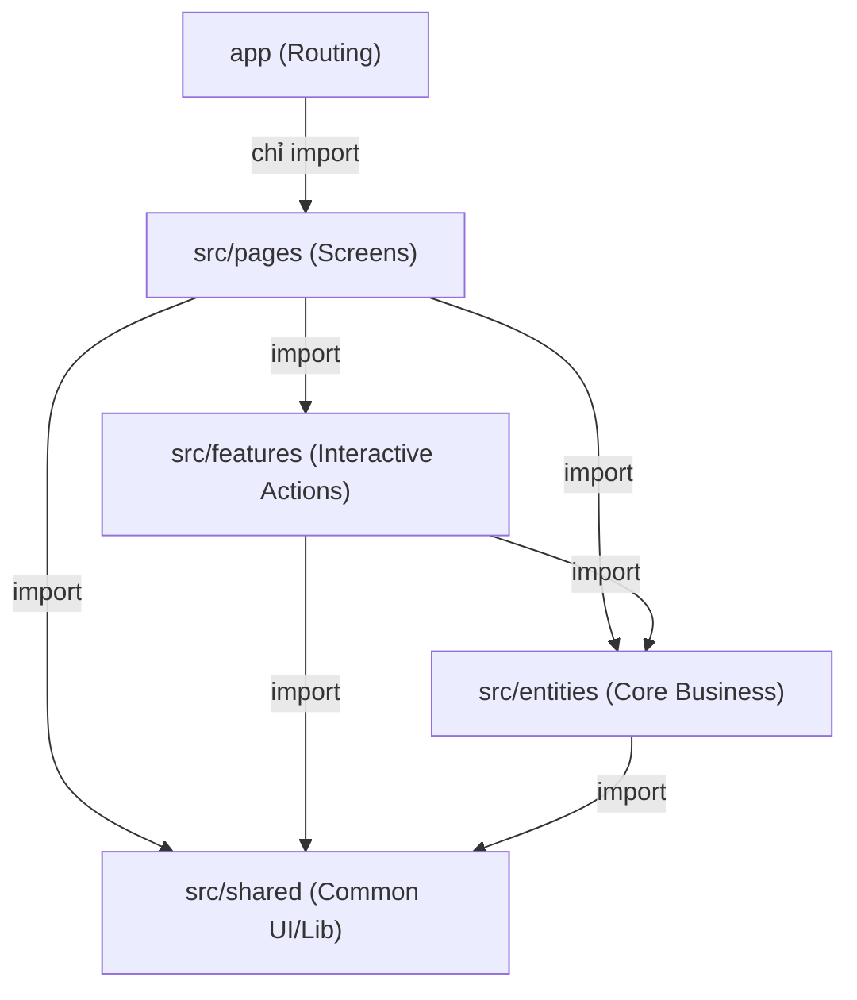

# QUY TẮC PHÁT TRIỂN & CẤU TRÚC THƯ MỤC MOBILE-USER
> **Mô hình kiến trúc:** Feature-Sliced Design (FSD) kết hợp Expo Router (Cách 2 - Tách biệt Routing & View)

Tài liệu này đóng vai trò là **quy tắc chung (Rule Book)** cho đội ngũ phát triển Sporta Mobile. Mọi lập trình viên khi tham gia dự án cần đọc kỹ và tuân thủ tuyệt đối cấu trúc này.

---

## 1. Sơ đồ cấu trúc thư mục tổng thể

```text
mobile-user/
├── app/                          # TẦNG ĐỊNH TUYẾN (ROUTING INFRASTRUCTURE)
│   ├── (auth)/                   # Phân nhóm Đăng nhập/Xác thực
│   │   ├── _layout.tsx           # Stack Navigator cho Auth
│   │   ├── login.tsx             # [Chỉ Re-export] Màn hình đăng nhập
│   │   └── otp-verify.tsx        # [Chỉ Re-export] Màn hình OTP
│   ├── (tabs)/                   # Phân nhóm Tab bar chính (Bottom Tabs)
│   │   ├── _layout.tsx           # Tab Navigator chính
│   │   ├── index.tsx             # [Chỉ Re-export] Trang chủ (Home)
│   │   ├── bookings.tsx          # [Chỉ Re-export] Quản lý đặt sân
│   │   ├── social.tsx            # [Chỉ Re-export] Mạng xã hội/Kèo đấu
│   │   └── wallet.tsx            # [Chỉ Re-export] Ví tài khoản
│   ├── booking/                  # Phân nhóm chức năng đặt sân chuyên biệt
│   │   └── [facilityId].tsx      # [Chỉ Re-export] Chi tiết sân theo ID
│   ├── profile/                  # Phân nhóm Hồ sơ
│   │   └── index.tsx             # [Chỉ Re-export] Thiết lập cá nhân
│   └── _layout.tsx               # Root Stack Navigator (Điều hướng tổng)
│
└── src/                          # TẦNG LOGIC & GIAO DIỆN (BUSINESS LAYER)
    ├── pages/                    # 1. TẦNG SCREENS/PAGES (Lắp ráp màn hình)
    │   ├── auth/
    │   │   ├── login/
    │   │   │   ├── ui/LoginScreen.tsx
    │   │   │   └── index.ts
    │   │   └── otp-verify/
    │   │       ├── ui/OtpVerifyScreen.tsx
    │   │       └── index.ts
    │   ├── home/
    │   │   ├── ui/HomeScreen.tsx
    │   │   └── index.ts
    │   ├── bookings/
    │   │   ├── ui/BookingsScreen.tsx
    │   │   └── index.ts
    │   ├── social/
    │   │   ├── ui/SocialScreen.tsx
    │   │   └── index.ts
    │   ├── wallet/
    │   │   ├── ui/WalletScreen.tsx
    │   │   └── index.ts
    │   ├── booking-detail/
    │   │   ├── ui/BookingDetailScreen.tsx
    │   │   └── index.ts
    │   └── profile/
    │       ├── ui/ProfileScreen.tsx
    │       └── index.ts
    │
    ├── features/                 # 2. TẦNG ACTIONS (Chức năng tương tác của User)
    │   └── book-court/           # Ví dụ: Feature đặt sân
    │
    ├── entities/                 # 3. TẦNG BUSINESS ENTITIES (Dữ liệu nghiệp vụ)
    │   ├── facility/             # Thực thể Sân vận động
    │   ├── court/                # Thực thể Sân đấu con (sân 5, sân 7, v.v.)
    │   └── user/                 # Thực thể Người dùng
    │
    └── shared/                   # 4. TẦNG COMMON/SHARED (Tài nguyên dùng chung)
        ├── ui/                   # Các UI Component nguyên tử (Button, Card, Input)
        ├── api/                  # Cấu hình Fetch/Axios client chung
        └── lib/                  # Các helper functions, utilities
```

---

## 2. Quy tắc 1: Vai trò của thư mục `/app` (Chỉ Re-export)

Thư mục `/app` **chỉ phục vụ mục đích định tuyến**. Nghiêm cấm viết giao diện, logic nghiệp vụ, gọi API hay xử lý state trong `/app`.

### Định dạng chuẩn của một file route trong `/app`
Các file màn hình trong `/app` (như `app/(tabs)/index.tsx`) **bắt buộc** chỉ chứa duy nhất một dòng re-export như sau:

```typescript
// Đúng quy tắc:
export { default } from '../../src/pages/home';

// Sai quy tắc (Không được viết code UI ở đây):
// import { View, Text } from 'react-native';
// export default function HomeScreen() { ... }
```

---

## 3. Quy tắc 2: Cấu trúc thư mục con trong `src/pages/`

Mỗi màn hình trong `src/pages/` sẽ được đặt trong một thư mục riêng biệt và bắt buộc có cấu trúc gồm:

1. Thư mục `ui/`: Chứa giao diện chính của màn hình. Tên file viết theo chuẩn **PascalCase** và có hậu tố `Screen` (Ví dụ: `HomeScreen.tsx`, `BookingDetailScreen.tsx`).
2. File `index.ts` (Public API): Đóng vai trò là cổng ra của màn hình, re-export default component từ thư mục `ui/`.
   ```typescript
   export { HomeScreen as default } from './ui/HomeScreen';
   ```

---

## 4. Quy tắc 3: Chiều đi của dữ liệu và quy định Import (FSD Layers)

Để tránh hiện tượng vòng lặp phụ thuộc (Circular Dependency) khiến code bị rối và lỗi build, tất cả lập trình viên phải tuân theo luồng import **một chiều** dưới đây:



> [!IMPORTANT]
> * **Không được import ngang hàng:** Tuyệt đối không import từ feature này sang feature khác (`features/auth` không được import từ `features/payment`).
> * **Không import ngược chiều:** Entities không được phép import bất cứ thứ gì từ Features hoặc Pages.
> * **Chỉ import qua Public API (`index.ts`):** Khi import từ lát cắt khác (slice), chỉ import thông qua file `index.ts` đầu mối của lát cắt đó.
>   * *Đúng:* `import { Button } from '@/src/shared/ui'` (export qua index.ts của ui)
>   * *Sai:* `import { Button } from '@/src/shared/ui/Button/Button'`

---

## 5. Hướng dẫn các bước khi tạo Màn hình mới

Khi có yêu cầu thêm một màn hình mới (ví dụ: Màn hình Danh sách sân yêu thích - **Favorites**):

* **Bước 1:** Tạo thư mục tương ứng trong `src/pages/`:
  `src/pages/favorites/ui/FavoritesScreen.tsx`
  `src/pages/favorites/index.ts` (export default FavoritesScreen)
* **Bước 2:** Lắp ráp màn hình bằng các component sẵn có ở `src/shared/ui` hoặc `src/features`.
* **Bước 3:** Đăng ký tuyến đường trong `/app`. Ví dụ thêm trang yêu thích vào Tab Bar:
  Tạo file `app/(tabs)/favorites.tsx`
  Thêm nội dung: `export { default } from '../../src/pages/favorites';`
  Đăng ký tab trong cấu hình `app/(tabs)/_layout.tsx`.
